# DOCKER AVANZADO

1. [Ejercicio 1: Servidor Nginx en modo demonio](#ejercicio-1-servidor-nginx-en-modo-demonio)
2. [Ejercicio 2: Uso de volúmenes en Nginx](#ejercicio-2-uso-de-volúmenes-en-nginx)
3. [Ejercicio 3: Construcción de una imagen con Dockerfile](#ejercicio-3-construcción-de-una-imagen-con-dockerfile)
4. [Ejercicio 4: Orquestación básica con Docker Compose](#ejercicio-4-orquestación-básica-con-docker-compose)
5. [Ejercicio 5: Despliegue de Nextcloud](#ejercicio-5-despliegue-de-nextcloud)

 

## Ejercicio 1: Servidor Nginx en modo demonio

El primer paso es crear el contenedor de Nginx. Para ello ejecutaremos el siguiente comando:

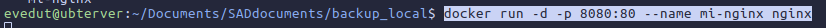

Si deseamos revisar que se haya creado correctamente, el comando `docker ps` .

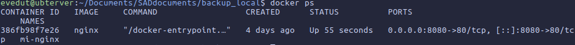

Si tratamos de conectarnos al puerto previamente creado, nos saldrá la página del contenedor.
OJO Atención!! Para acceder a la web tendremos que escribirlo con el siguiente formato:

`http://ip-servidor(o localhost)/puerto`

En este caso, se utiliza una máquina virtual como ejemplo, por lo que tendremos que escribir su IP para acceder desde fuera.

`http://192.168.4.153:8080`

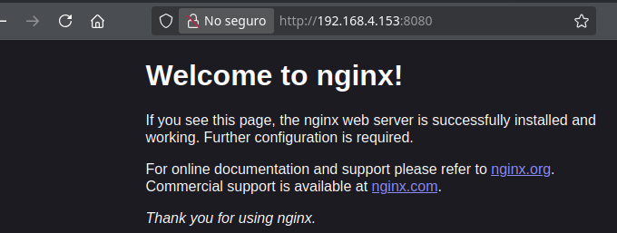

También podremos acceder a los logs con `docker logs "contenedor"` .

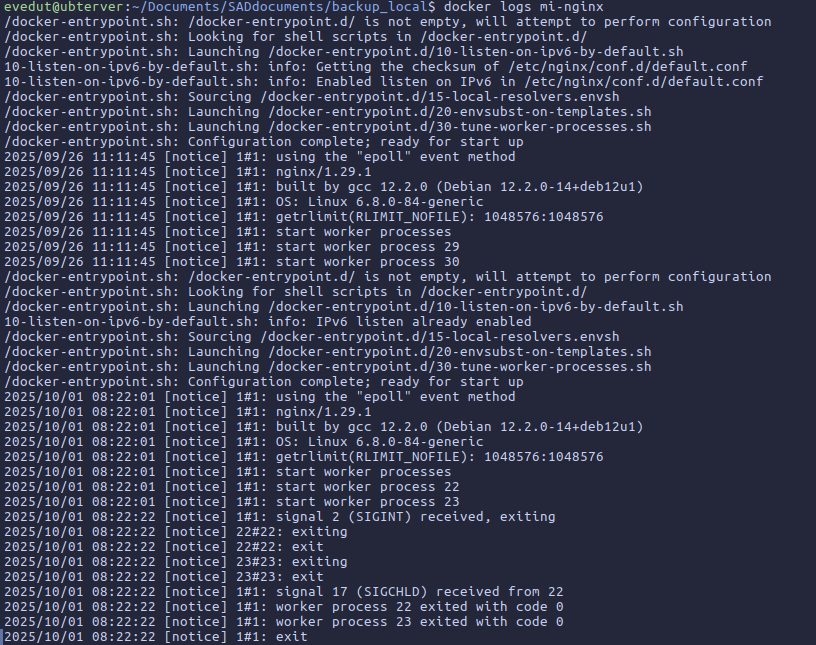

## Ejercicio 2: Uso de volúmenes en Nginx

Nos dirigimos a `usr/share/"contenedor"/html` .

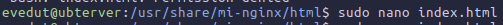

Hacemos el html...

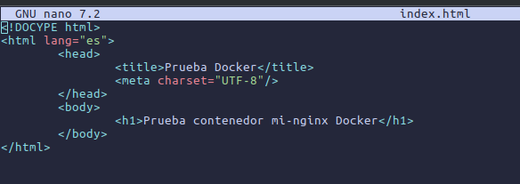

Ahora si ejecutamos el siguiente comando, montaremos el contenedor Nginx en un volumen dentro de una carpeta en el home de nuestro usuario.

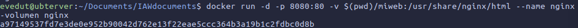

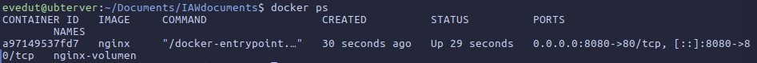

Si volvemos a acceder a la web...

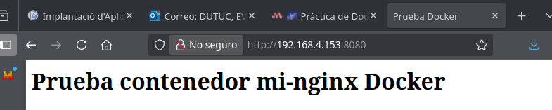

Y si actualizamos el html y luego volvemos a acceder:

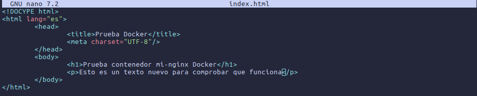

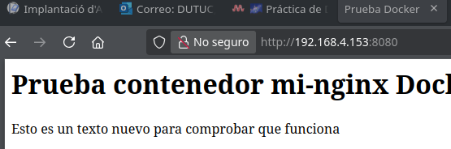

## Ejercicio 3: Construcción de una imagen con Dockerfile

Crearemos un html distinto al ya creado anteriormente.

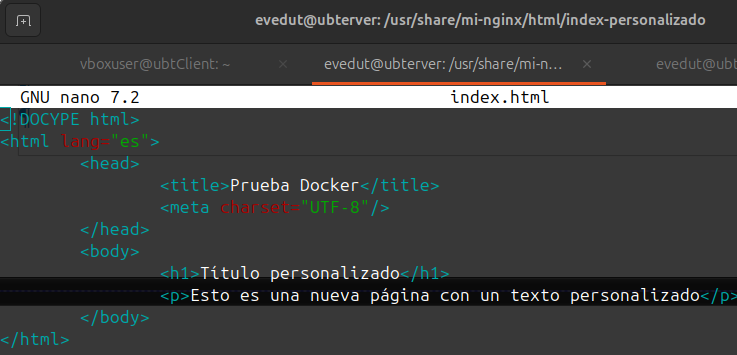

Ahora crearemos un dockerfile (tal cual un archivo llamado "dockerfile" sin extension) y dentro de el añadiremos las líneas que empiecen por "FROM" y "COPY":

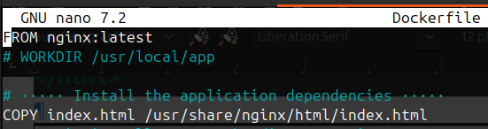

Para generar la imagen a partir del docker file, ejecutamos `docker build -t "nombre" .`

*El punto es si el archivo dockerfile esta en la misma ubicación en la que ejecutas el comando, de lo contrario habría que poner la ruta del archivo.*

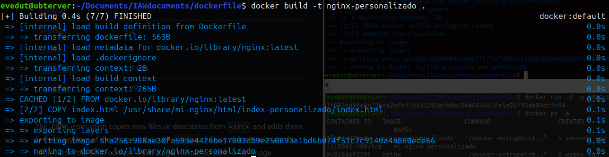

Ahora haremos un docker run, **PERO OJO CUIDADO DE PONER EL MISMO PUERTO QUE EL CONTENEDOR ORIGINAL**.

Si en el otro contenedor utilizamos el puerto "8080:80", en este utilizaremos el "8081:80"

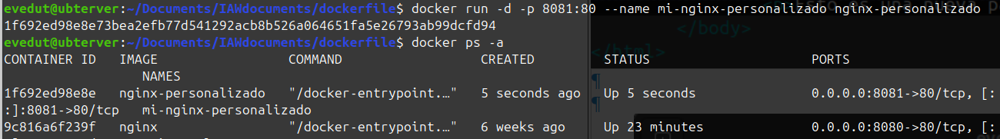

Ahora si accedemos al puerto correcto, observaremos que se muestra nuestra página.

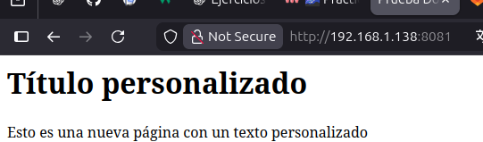

## Ejercicio 4: Orquestación básica con Docker Compose

Antes de empezar con Docker Compose, habrá que instalarlo. Ejecutamos: `sudo apt install docker-compose`

Una vez instalado "docker-compose" procederemos a crear un archivo yaml.

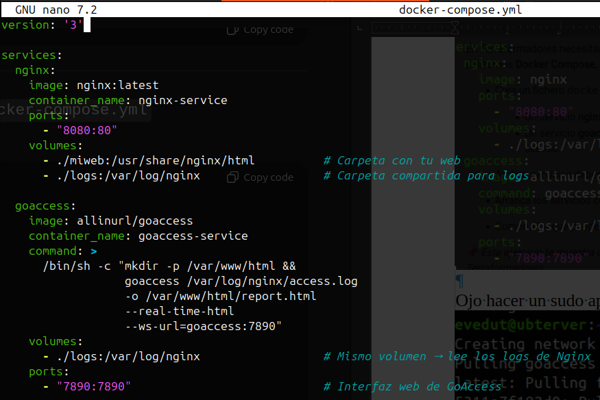

Con este archivo, ejecutamos `docker-compose up -d` para ponerlo en marcha.

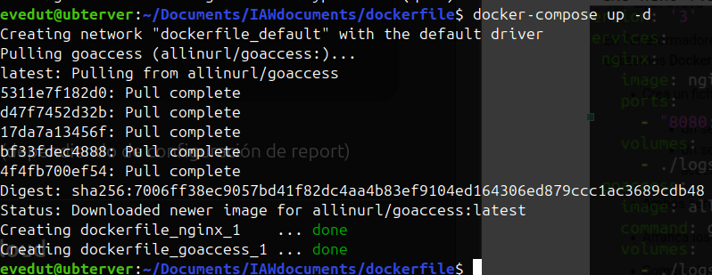

Con `docker-compose ps` podremos ver que se han creado exitosamente.

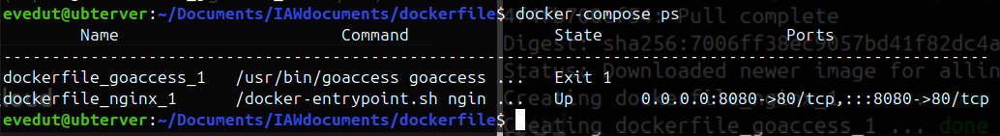

## Ejercicio 5: Despliegue de Nextcloud

Para poder crear el contenedor de Nextcloud, ejecutaremos el docker run mostrado en pantalla:

***Otra vez cambiamos el puerto para no generar conflictos!!!***

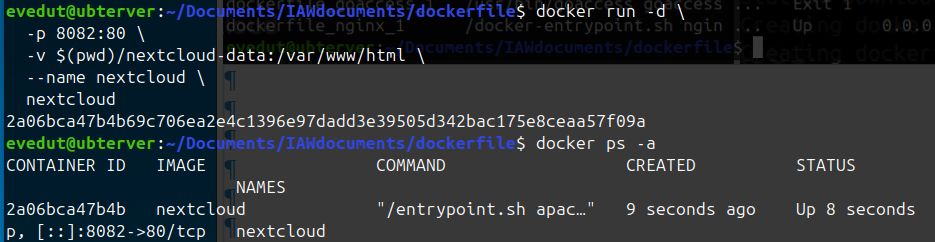

Si es correcto, al conectarnos a nuestro puerto nos saldrá la configuración inicial para utilizar este servicio:

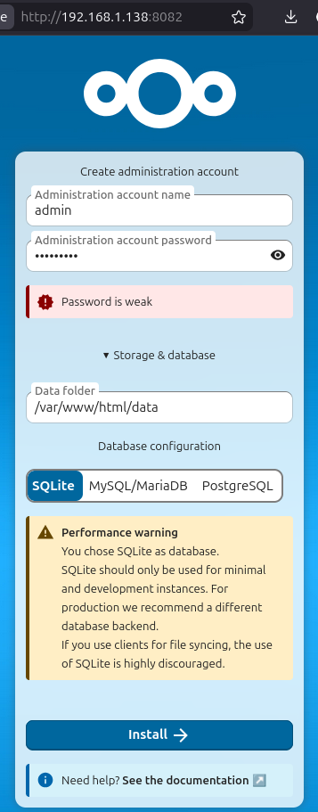