# APRENDIENDO SOBRE LAS RAMAS EN GIT

### Índice
  1. [Ejercicio individual](#ejercicios-individuales)
  - 1.1. [Apartado 1: Listar ramas locales](#apartado-1-listar-ramas-locales)
  - 1.2. [Apartado 2: Creación de una nueva rama](#apartado-2-creación-de-una-nueva-rama)
  - 1.3. [Apartado 3: Modificación](#apartado-3-modificación)
  - 1.4. [Apartado 4:Fusión](#apartado-4-fusión)
  - 1.5. [Apartado 5: Conflictos](#apartado-5-conflictos)
  - 1.6. [Apartado 6: Sincronizar repositorio remoto](#apartado-6-sincronizar-repositorio-remoto)
  - 1.7. [Apartado 7: Eliminando la rama](#apartado-7-eliminando-la-rama)

 

# EJERCICIOS INDIVIDUALES
## Apartado 1: Listar ramas locales
Para mirar las ramas que tenemos creadas ejecutamos un `git branch`

## Apartado 2: Creación de una nueva rama
Ahora para crear una rama ejecutamos un `git branch "nombre_rama"`.
Una vez creada nos movemos a ella con `git checkout "nombre_rama"`.

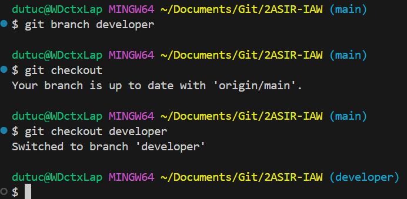

*También sirve* `git checkout -b "nombre_rama"` *para crearla y cambiarnos directamente.*

## Apartado 3. Modificación
Empezamos a fusionar...

Crearemos un fichero desde la rama que habremos creado y acabaremos con un commit:

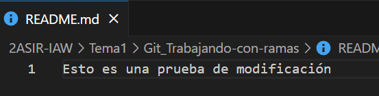
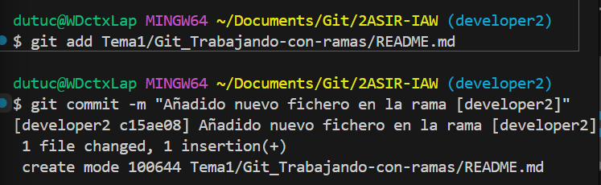

## Apartado 4: Fusión
Ahora nos vamos a main y fusionamos la rama con `git merge "nombre_rama"`:

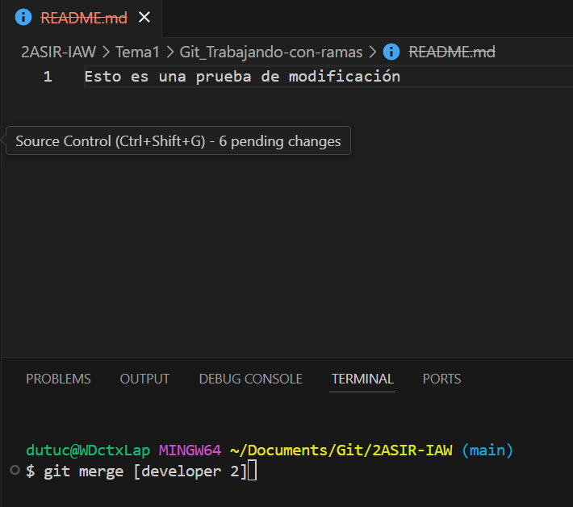

Si no hay conflictos, todo irá bien.

## Apartado 5: Conflictos
Crearemos a propósito un conflicto para solucionarlo.

Primero crearemos un fichero ***prueba.txt*** en la rama ***main*** y haremos un commit.

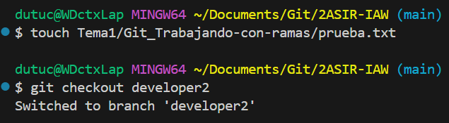
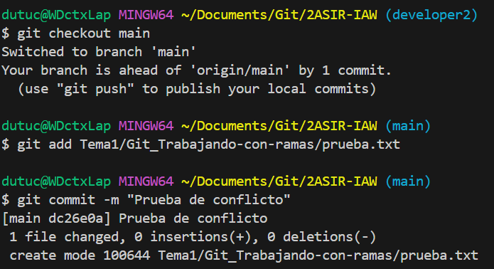

Cambiamos a una nueva rama, modificamos el fichero y haremos otro commit.

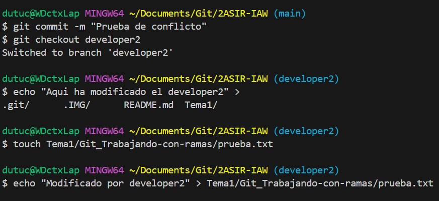

Volvemos a la rama ***main***, modificamos el fichero de nuevo y luego intentaremos fusionar la nueva rama.

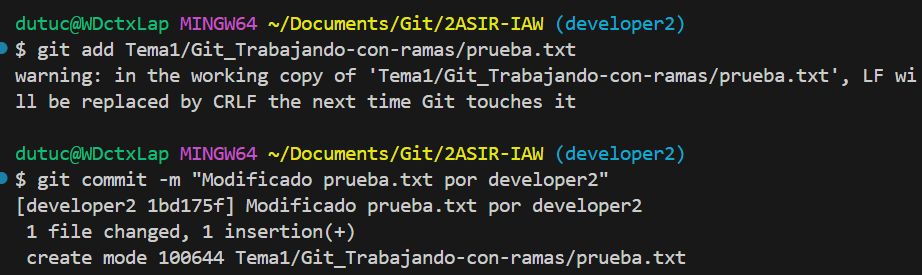

Si surge un conflicto, Git te lo mostrará y podrás resolverlo manualmente.

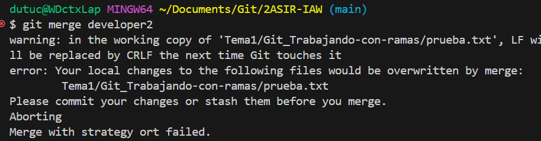

## Apartado 6: Sincronizar repositorio remoto
Para sincronizar con el repositorio remoto, subiremos la rama local con `git push origin "nombre_rama"`:

## Apartado 7: Eliminando la rama
Finalmente, una vez fusionada, la eliminamos para mantener el repositorio limpio utilizando `git branch -d "nombre_rama"`:

# EJERCICIOS EN PAREJA
## Apartado 1: Creando repositorio

  El primer paso es crear un repositorio para poder trabajar en parejas. En este caso se creará en GitLab:

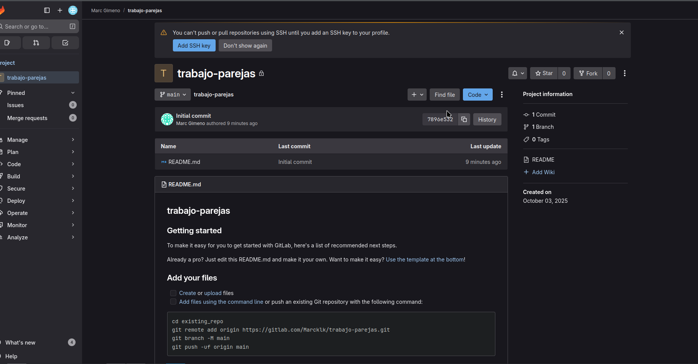

  Una vez creado el repositorio haremos un clon para tenerlo en la máquina local:

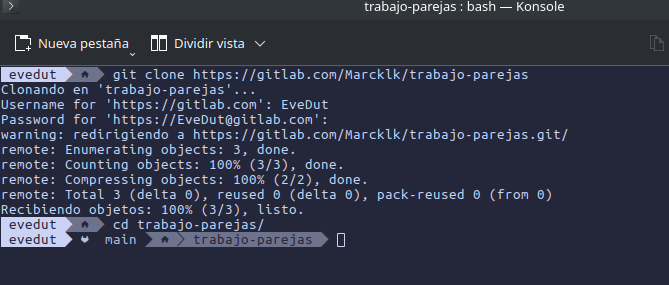

## Apartado 2: Creando ramas

  Ahora generaremos una rama para cada miembro, en mi caso sera "parejas/evelin".

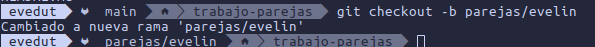

## Apartado 3: Generando el conflicto

  Para generar el conflicto, crearemos un fichero en nuestra rama con un texto de ejmplo. Cada miembro deberá escribir un mensaje distinto en un fichero con el mismo nombre.

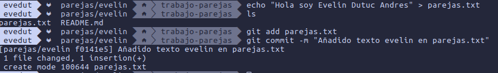

  Ahora que tenemos el archivo y hecho el commit, procederemos a subirlo para generar el conflicto. Seguiremos los siguientes pasos:

  <b>Subimos la rama:</b>

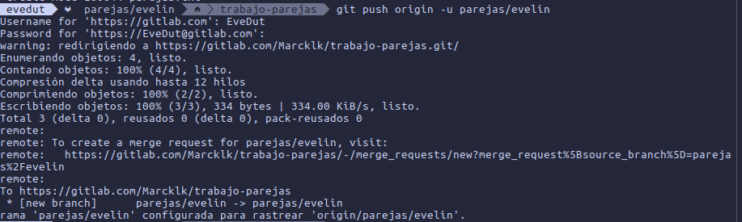

  <b>Cambiamos a main y hacemos el merge:</b>

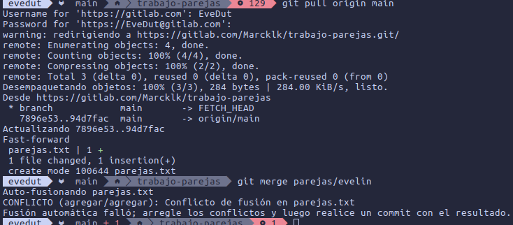

  <b>Si hacemos un git status veremos el conflicto:</b>

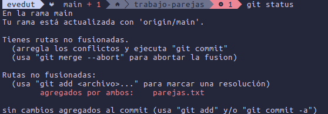

## Apartado 4: Solucionando el conflicto

  Para generar el conflicto, tuvimos que hacer un merge desde una rama, y luego otro desde la otra rama. En mi caso se ve como genera el conflicto, por lo que es el segundo commit del mismo archivo. Como teníamos el <b>mismo archivo con un texto diferente en la mísma línea</b>, se ha generado el conflicto.

  Cuando vayamos a abrir el archivo, nos saldrá lo siguiente:

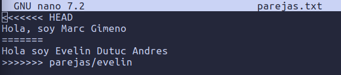

  Borramos las líneas que nos han añadido en el archivo (<<<<<<<< HEAD; =======; >>>>>>> parejas/evelin) y ponemos un texto que queramos.

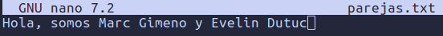
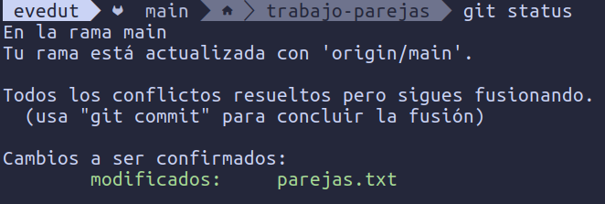

  Una vez hecho el "git add -u" y el "git commit", prodcederemos con el git push:

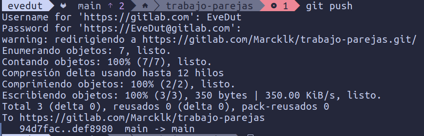

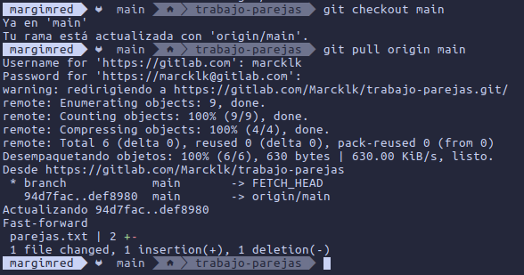

## Apartado 5: Mirando los commits realizados

  Finalmente aqui podremos ver todos los commits de todas las ramas:

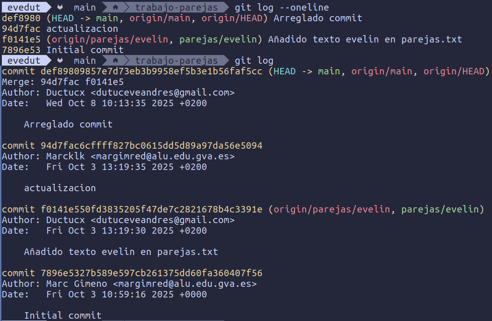