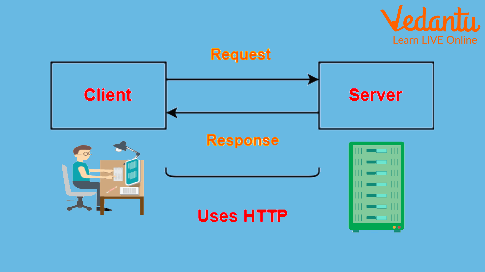

# El protocolo HTTP

## Índice
1. [HTTP](#hyper-text-transfer-protocolHyper-Text-Transfer-Protocol)<br>
2. [HTML](#html)<br>
3. [Tim Barners-Lee](#tim-barners-lee)<br>
4. [HTTPS](#https)


## Hyper Text Transfer Protocol

El protocolo **Hyper Text Transfer Protocol** o **HTTP** es un protocolo de *comunicación* que permite la *transferencia* de información a través de archivos en la de html para <u>World Wide Web</u>

---

### HTML

Lenguajes de marcas como puede ser el HTML, se basa en representar información mediante un documento .html que a su vez se muestra mediante el protocolo HTTP.

Este lenguaje utiliza etiquetas que se muestran de la siguiente manera:

`<p>Esto es un párrafo de prueba</p>`

Pero una estructura con este lenguaje se vería algo parecido a la siguiente:

```html
<!DOCTYPE html>
<html lang="en">
    <head>
        <meta charset="UTF-8">
        <meta name="viewport" content="width=device-width, initial-scale=1.0">
        <title>Document</title>
    </head>
    <body>
        <h1>Esto es un título principal!!!</h1>
        <p>Y esto un texto en un párrafo</p>
    </body>
</html>
```

En resumidas cuentas, así es como funciona super resumido el protocolo HTTP:

1. <u>Cliente servidor</u>: El navegador pide, el servidor responde.
2. <u>Solicitud y Respuesta:</u> El cliente pide algo **(request)**, el servidor responde **(response)**.
3. <u>Sin memoria:</u> No recuerda peticiones anteriores.
4. <u>Métodos:</u> Ej. **GET** *(ver)*, **POST** *(enviar)*.
5. <u>Códigos:</u> Ej. **200** *(OK)*, **404** *(No encontrado)*, **500** *(Error)*.
---

### Tim Barners-Lee
Su creador es Tim Barners-Lee, por lo que a continuación habrán algunas características sobre el:

- <u>Inventó la Web:</u> Creó la World Wide Web en 1989, donde se usa HTTP para navegar.
- <u>Diseñó HTTP:</u> Fue quien propuso y desarrolló el protocolo HTTP para comunicar navegadores y servidores.
- <u>Creó el primer sitio web.</u> En 1991, usó HTTP para que otros pudieran acceder a páginas desde cualquier lugar.

He aquí unos enlaces para mas información sobre [Tim Barners-Lee](https://es.wikipedia.org/wiki/Tim_Berners-Lee) y
[HTTP](./enlazado.md).


---

### HTTPS
A dia de hoy es menos común encontrarse con páginas con el protocolo http, de hecho estas se deberían de evitar ya que no son seguras.
<br><br>
Se podria ver mas en páginas de configuración del router o impresoras pero por lo general estas no son seguras.
<br><br>
Hoy en día se utiliza **HTTPS**, que es lo mismo pero seguro *(Hyper Text Transfer Protocol Secure)*. Por ello se mostrará a continuación una tabla comparativa entre *HTTP* y *HTTPS*:

|               |            HTTP            |               HTTPS               |
|---------------|----------------------------|-----------------------------------|
|**Significado**|Hyper Text Transfer Protocol|Hyper Text Transfer Protocol Secure|
|**Protocolos** |HTTP1 y 2 utilizan el protocolo TCP/IP. HTTP3 utiliza QUIC|HTTP2|
|**Puertos**    |Puerto 80 por defecto|Puerto 443 por defecto|
|**Uso**        |Sitios web antiguos basados en texto o páginas de configuración de router, impresoras, etc.|Todas las web modernas|
|**Seguridad**  |Sin funciones de seguridad|Utiliza certificados SSL para el cifrado de clave pública|
|**Beneficios** |Hizo posible la comunicación a través de Internet|Mejora la utoridad del sitio web, la confianza y el posicionamiento en los motores de búsqueda|

<br>

## Bibliografía
[Cheat-sheet](https://www.markdownguide.org/cheat-sheet/)<br>
[Guía-markdown](https://www.markdownguide.org/)<br>
[Comparativa-protocolos](https://aws.amazon.com/es/compare/the-difference-between-https-and-http/)

<br>

===== [Volver a inicio](#el-protocolo-http) =====


