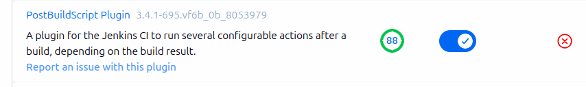
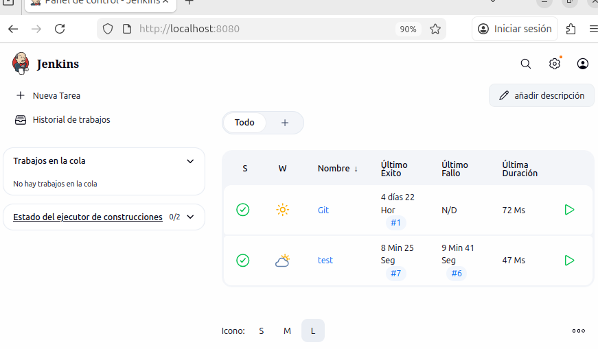
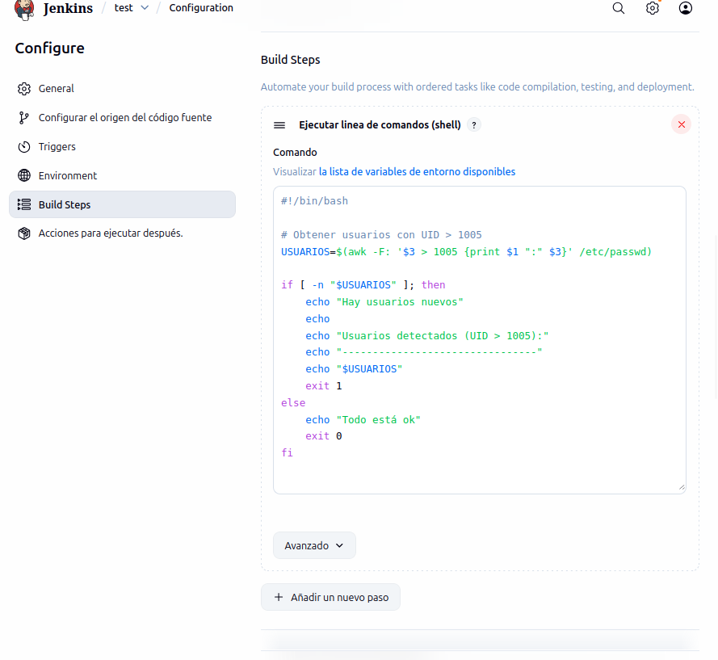
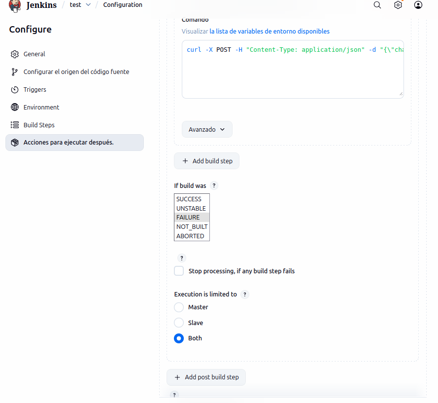

# Job Básico

1. [Instalación del plugin](#instalación-del-plugin)
2. [Ejecución de la tarea](#ejecución-de-la-tarea)

<br/>

# Instalación del plugin

En nuestro jenkins, ejecutando desde nuestro navegador web `http://localhost:8080` , Entraremos y descargaremos un nuevo plugin llamado `postBuildScript Plugin` en `Configuración>Pluguins>Añadir nuevo plugins` .

*El puerto puede variar según lo tengas configurado, pero ese el por defecto*



----
# Ejecución de la tarea

Ahora que tenemos el plugin, creamos una nueva tarea llamada `test` por el momento:



Dentro añadimos que se ejecute el siguiente script para comprobas si se han creado usuarios con el uid > 1005:



Creamos un PostBuildScript para que en caso de que falle mande un mensaje en nuestro bot de Telegram:

```sh
curl -X POST -H "Content-Type: application/json" -d "{\"chat_id\": \"7129418357\", \"text\": \"Éxito en la tarea $JOB_NAME!! $BUILD_NUMBER,  \", \"disable_notification\": false}" https://api.telegram.org/bot8359929826:AAGsbaro2VzkHp9cB-UcJUrTjJKIrf0tvC8/sendMessage
```



En el caso de que falle debería de mandarnos un mensaje, de lo contrario no enviará nada...