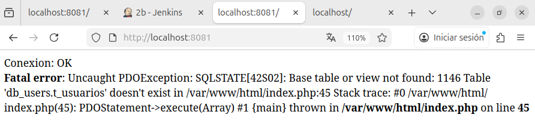
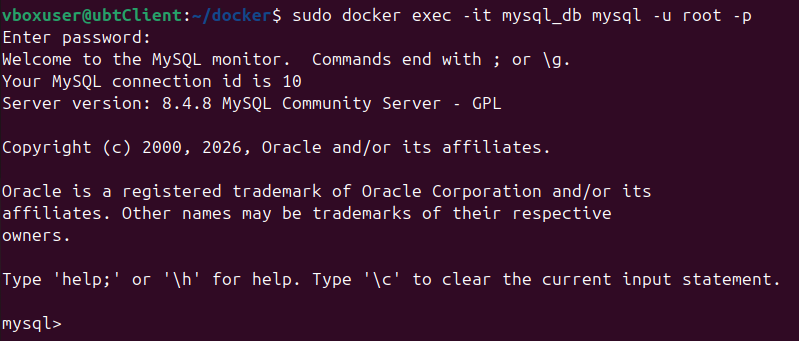
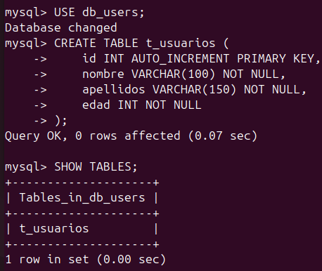
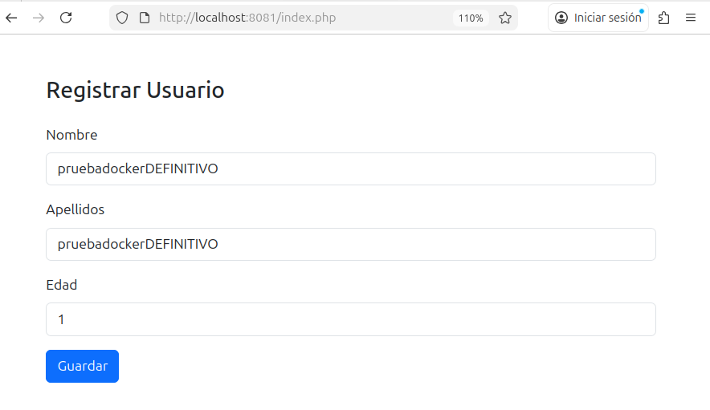
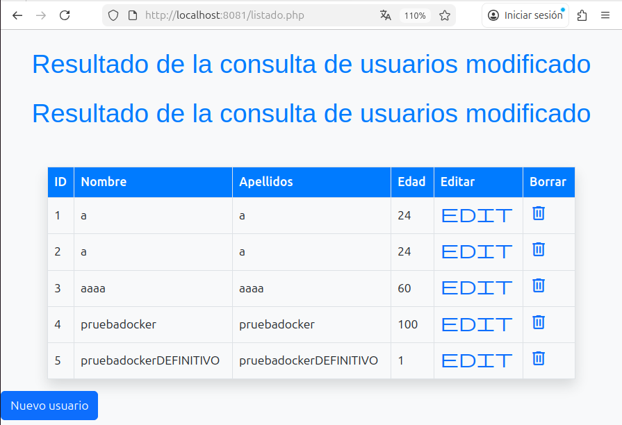

# FreestyleJob

1. [Docker compose](#docker-compose)
2. [Archivos php](#archivos-php)
3. [Crear la tabla](#crear-la-tabla)

<br/>

## Docker compose

Antes de empezar, mencionar que vamos a crear un volumen a partir de el directorio /var/www/html de la práctica anterior

Creamos un archivo docker compose, pero primero debemos de tener instalado docker compose. Si su sistema no dispone del paquete, se instala con:

```sh
sudo apt update
sudo apt install docker-compose
```

Creamos el archivo con:

```sh
sudo nano dockercompose.yml
```

Este es el archivo docker compose:

```yaml
services:
  web:
    build: ./dockerfile
    container_name: apache_php
    ports:
      - "8081:80"              # http://localhost:8081
    volumes:
      - /srv/jenkins/www:/var/www/html    # www → contenedor
    depends_on:
      - db
    restart: always

  db:
    image: mysql:8
    container_name: mysql_db
    environment:
      MYSQL_ROOT_PASSWORD: 1234
      MYSQL_DATABASE: db_users
    ports:
      - "3310:3306"
    volumes:
      - db_data:/var/lib/mysql
    restart: always

volumes:
  db_data:
```

Y dentro del dockerfile disponemos de la siguiente configuración. En `./dockerfil/Dockrfile` :

```dockerfile
FROM php:8.2-apache
RUN docker-php-ext-install pdo pdo_mysql mysqli
RUN a2enmod rewrite
```

Levantamos el docker compose ejecutando la siguiente línea:

```sh
sudo docker compose up -d
```

## Archivos php

### conexionMysql.php

Este es el archivo que utilizaremos para la conexión (Esta algo tocado de la anterior práctica ya que trabajamos en otro entorno)

Hay que declarar el puerto y como "host" no pondremos "localhost" ya que nos saltará un erro. Ponemos el nombre de la base de datos que hemos puesto en el docker compose, en este caso es "db":

```php
<?php
$host="db";
$port="3306";
$user="root";
$pass="1234";
$db="db_users";

$dbsys="mysql:host=$host;port=$port;dbname=$db;charset=utf8";

try {
    $conex = new PDO($dbsys, $user, $pass);
    $conex->setAttribute(PDO::ATTR_ERRMODE, PDO::ERRMODE_EXCEPTION);
} catch (PDOException $exception) {
    echo "Fallo en la conexion: ".$exception->getMessage();
}
?>

```

### index.php

```php
<?php
    include 'conexionMysql.php';

    $id = isset($_GET['id']) ? $_GET['id'] : null;
    $titulo = $id ? "Editar Usuario" : "Registrar Usuario";
    $usuario = null;

    if ($id) {
        $sql = "SELECT * FROM t_usuarios WHERE id = :id";
        $stmt = $conex->prepare($sql);
        $stmt->execute([':id' => $id]);
        $usuario = $stmt->fetch(PDO::FETCH_ASSOC);
    }

    if ($_SERVER['REQUEST_METHOD'] == 'POST') {

        $id     = $_POST['id'] ?? null;
        $nombre = $_POST['nombre'];
        $apellidos  = $_POST['apellidos'];
        $edad    = $_POST['edad'];

        if ($id) {
            $sql = "UPDATE t_usuarios
                    SET nombre = :nom, apellidos = :ape, edad = :edad 
                    WHERE id = :id";

            $params = [
                ':id'  => $id,
                ':nom'  => $nombre,
                ':ape'  => $apellidos,
                ':edad' => $edad
            ];
        } else {
            $sql = "INSERT INTO t_usuarios (nombre, apellidos, edad) 
                    VALUES (:nom, :ape, :edad)";

            $params = [
                ':nom' => $nombre,
                ':ape' => $apellidos,
                ':edad' => $edad
            ];
        }

        $stmt = $conex->prepare($sql);
        $stmt->execute($params);

        header("Location: listado.php");
        exit;
    }
?>

<!DOCTYPE html>
<html lang="es">
    <head>
        <meta charset="UTF-8">
        <meta name="viewport" content="width=device-width, initial-scale=1.0">
        <title><?php echo $titulo; ?></title>
        <link href="https://cdn.jsdelivr.net/npm/bootstrap@5.3.2/dist/css/bootstrap.min.css" rel="stylesheet">
    </head>
    <body>

    <div class="container mt-5">
        <h3 class="mb-4"><?php echo $titulo; ?></h3>

        <form action="" method="POST">
            <input type="hidden" name="id" value="<?php echo $id; ?>">


            <div class="mb-3">
                <label class="form-label">Nombre</label>
                <input type="text" name="nombre" class="form-control"
                    value="<?php echo $id ? $usuario['nombre'] : ''; ?>" required>
            </div>


            <div class="mb-3">
                <label class="form-label">Apellidos</label>
                <input type="apellidos" name="apellidos" class="form-control" value="<?php echo $id ? $usuario['apellidos'] : ''; ?>" required>
            </div>


            <div class="mb-3">
                <label class="form-label">Edad</label>
                <input type="edad" name="edad" class="form-control" value="<?php echo $id ? $usuario['edad'] : ''; ?>" required>
            </div>


            <button type="submit" class="btn btn-primary">
                <?php echo $id ? 'Actualizar' : 'Guardar'; ?>
            </button>
        </form>
    </div>

    </body>
</html>
```

### listado.php
```php
!DOCTYPE html>
<html lang="en">
    <head>
        <meta charset="UTF-8">
        <meta name="viewport" content="width=device-width, initial-scale=1.0">
        <title>Document</title>
        <link href="https://cdn.jsdelivr.net/npm/bootstrap@5.3.0-alpha1/dist/css/bootstrap.min.css" rel="stylesheet">
        <link rel="stylesheet" href="https://fonts.googleapis.com/css2?family=Material+Symbols+Outlined:opsz,wght,FILL,GRAD@24,400,0,0&icon_names=edit" />
        <link rel="stylesheet" href="https://fonts.googleapis.com/css2?family=Material+Symbols+Outlined:opsz,wght,FILL,GRAD@24,400,0,0&icon_names=delete" />
        <style>
            body {
                background-color: #f8f9fa;
            }

            .table th, .table td {
                vertical-align: middle;
            }
            .table thead {
                background-color: #007bff;
                color: white;
            }
            .table tbody tr:hover {
                background-color: #f1f1f1;
            }
            h1 {
                color: #007bff;
                font-family: 'Arial', sans-serif;
            }
            .container {
                margin-top: 50px;
            }
        </style>
    </head>
    <body>
        <?php 

            include 'conexionMysql.php';

            $sql="SELECT * from t_usuarios";

            $res= $conex->query($sql);

            echo "<h1 class='text-center my-4'>Resultado de la consulta de usuarios modificado</h1>";
            echo "<h1 class='text-center my-4'>Resultado de la consulta de usuarios modificado</h1>";
            echo "<div class='container'>";
            echo "<table class='table table-bordered table-hover shadow'>";
                echo "<thead>";
                    echo "<tr>";
                        echo "<th>ID</th>";
                        echo "<th>Nombre</th>";
                        echo "<th>Apellidos</th>";
                        echo "<th>Edad</th>";
                        echo "<th>Editar</th>";
                        echo "<th>Borrar</th>";
                    echo "</tr>";
                echo "</thead>";
                echo "<tbody>";
        while($fila=$res->fetchObject())
                {
                    echo "<tr>";
                        echo "<td>".$fila->id."</td>";
                        echo "<td>".$fila->nombre."</td>";
                        echo "<td>".$fila->apellidos."</td>";
                        echo "<td>".$fila->edad."</td>";
                        echo '<td><a href="./edit.php?id='.$fila->id.'"><span class="material-symbols-outlined"> edit </span></a></td>';
                        echo '<td><a href="./delete.php?id='.$fila->id.'"><span class="material-symbols-outlined">delete</span></a></td>';

                    echo "</tr>";
                }
            echo "</tbody>";
            echo "</table>";
            echo "</div>";

        ?>

        <a href="./index.php"><button type="button" class="btn btn-primary">Nuevo usuario</button></a>
        <script src="https://cdn.jsdelivr.net/npm/bootstrap@5.3.0-alpha1/dist/js/bootstrap.bundle.min.js"></script>

    </body>
</html>
```
Todos estos archivos se han reutilizado de la anterior práctica

## Crear la tabla

Aunque tengamos un MySql instalado con su tabla y todo, hay que tener en cuenta que estamos trabajando en un contenedor y por ende da igual lo que tengamos instalado en la máquina anfitriona porque todo queda dentro del propio docker. Por ello debemos de crear una tabla para evitar el siguiente error:



Abrimos la terminal y ejecutamos el siguiente comando:

```sh
docker exec -it mysql_db mysql -u root -p
```

Esto lo que hace es entrar en el contenedor, concretamente en el mysql que hemos instalado y como root. Ponemos la contraseña que es "1234" y listo, estamos dentro:



Creamos la tabla:



Ahora probamos a acceder a la web. Veremos que ya funciona correctamente:





Con esto hemos finalizado la práctica