# Tarea 1: LAMP

1. [Apache2](#apache2)
2. [MySQL](#mysql)
3. [PHP](#php)
4. [PHPMyAdmin](#phpmyadmin)
5. [GoAcces](#goacces)

<br/>


## Apache2

En primer lugar, instalamos apache con un `sudo apt install apache2` :

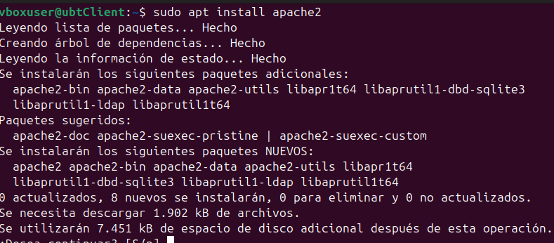

Para asegurarnos que iniciará cada vez que entremos en nuestra máquina, ejecutamos `sudo apt install apache2` :

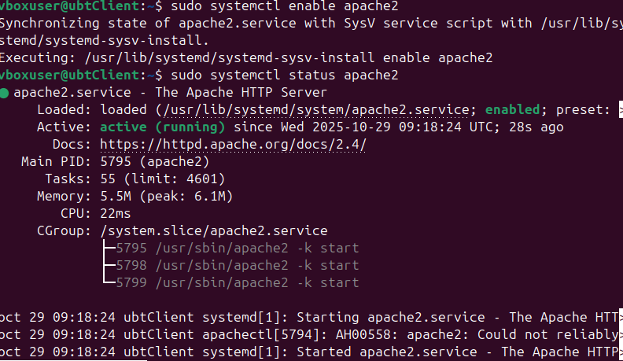

He aquí una pequeña explicación sobre el funcionamiento de los diferentes archivos y directorios de apache2.

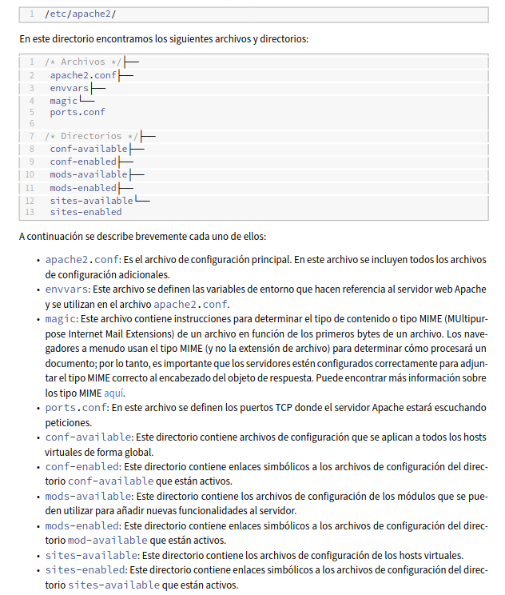

Y ya por último, si hemos instalado e iniciado el servidor apache2, podremos acceder a la página principal desde el navegador web.

Introducimos `http://ip_servidor` o `http://localhost`

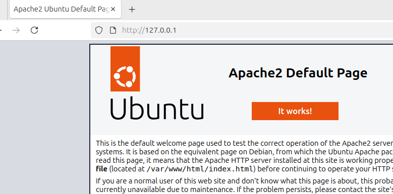

## MySQL

Para la instalación de mysql, ejecutamos `sudo apt install mysql-server` .

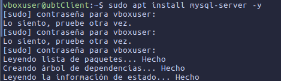

Ahora podremos acceder mediante root con el siguiente comando: `sudo mysql -u root -p`

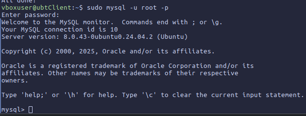

Una vez dentro, creamos nuestra base de datos de Terraformadores.

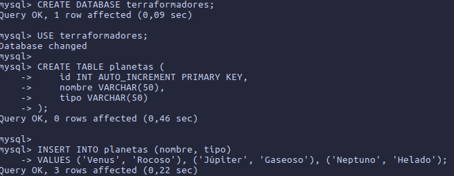

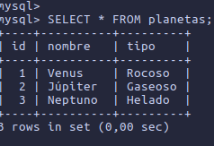

## PHP

Lo siguiente que vamos a instalar es php.

`sudo apt install php libapache-mod-php php-mysql`


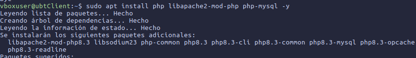

Una vez instalado, si deseamos ver la verison de php ejecutamos `php -v` .

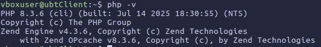

Ahora, para probar que funciona nuestro php, vamos a `/var/www/html` y creamos el archivo `info.php` .

Dentro de el escribimos las siguientes líneas:

***phpinfo()*** *muestra información de la versión instalada del php y el sistema.*

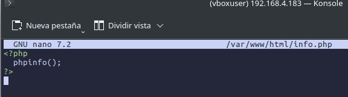

Hacemos un `sudo systemctl restart apache2` para que funcione y accedemos a la web escribiendo `http://ip_servidor/info.php` .

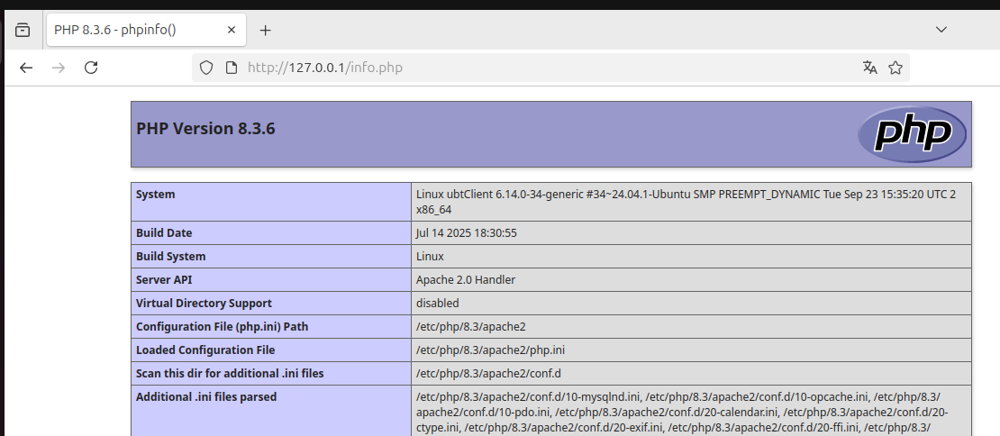

Finalmente, creamos un archivo php para establecer la conexión con la base de datos:

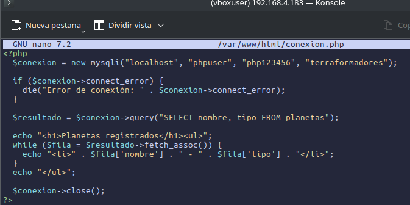

Nos conectamos por la web mediante `http://ip_servidor/nombre_archivo` :

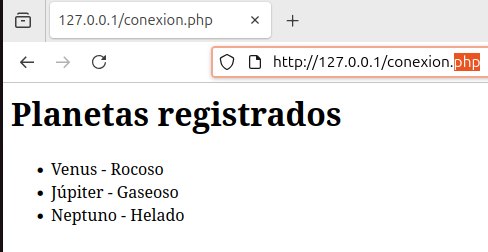

## PHPMyAdmin

Seguimos con PHPMyAdmin. La instalación consta de la siguiente línea:

`sudo apt install phpmyadmin php-mbstring php-zip php-gd php-json php-curl`

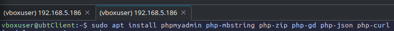

Para poder seguir adelante sin errores, seleccionamos la opción "**Si**":

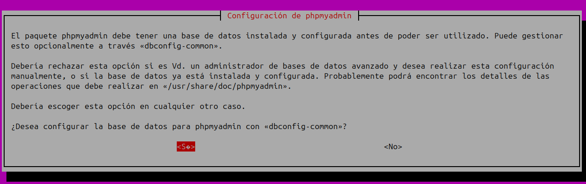

Introducimos la contraseña:

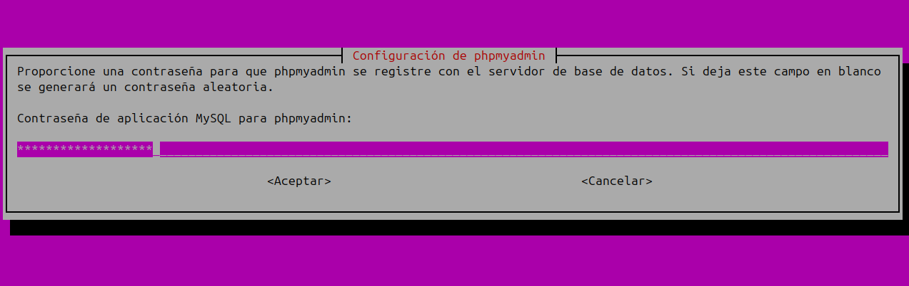

Nos saldrá una ventanita de la instalación, seleccionamos apache 2 **CON LA BARRA ESPACEADORA**, luego pulsamos **Enter**:

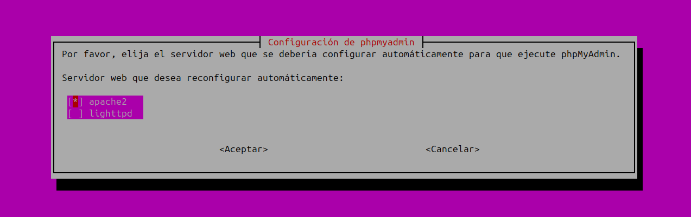

**ATENCIÓN!!!**

Si se da el caso de que aparezca el siguiente error, a continuación se explicará como solucionarlo. De lo contrario seguir hasta el final de la [instalación de PHP](#acceso-a-la-web).

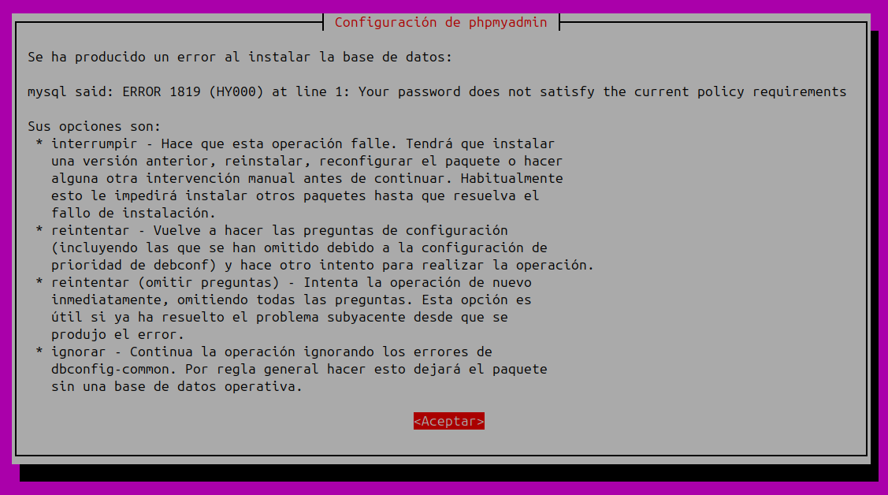

Una vez haya salido el error, interrumpimos el programa, seleccionando **Aceptar>Interrumpir** .

Después accedemos a nuestro **mysql** con `sudo mysql` y ejecutamos el siguiente comando:

```sql
UNINSTALL COMPONENT "file://component_validate_password";
```

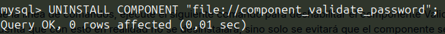

Salimos de nuestro **mysql** y volvemos a instalar **PHPMyAdmin**.

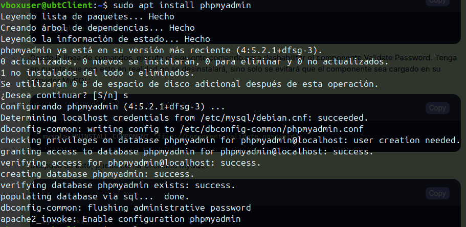

Ahora, la instalación no dará problemas...

Para dejar todo como estaba, volvemos a entrar en **mysql** y vovlemos a instalar lo que hemos desinstalado anteriormente:

```sql
INSTALL COMPONENT "file://component_validate_password";
```

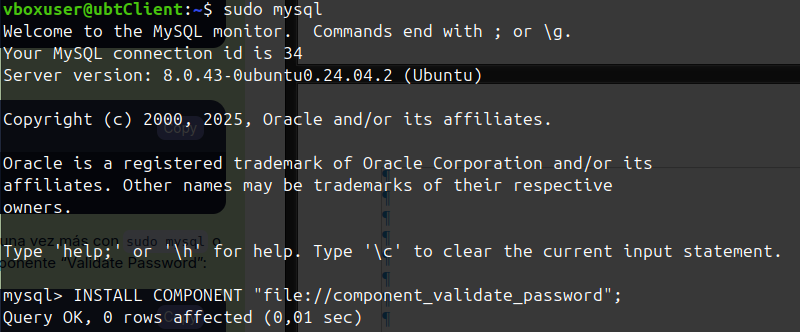

### Acceso a la web

**UNA VEZ INSTALADO TODO**, nos podremos conectar con `http://ip_servidor/phpmyadmin` .

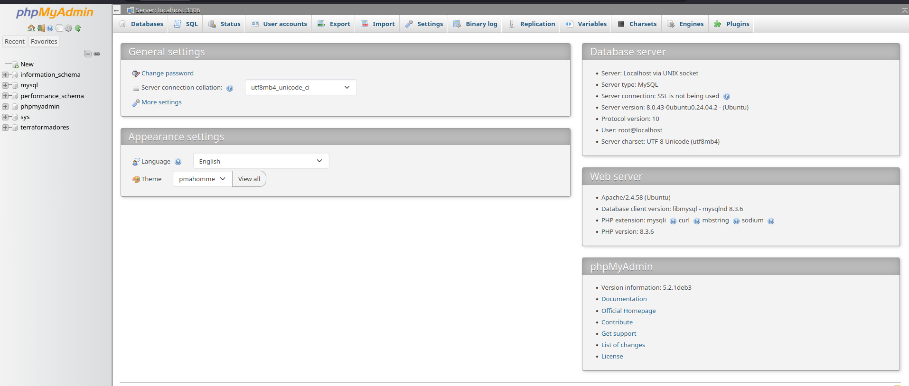

## GoAcces

Por último, instalaremos una herramienta para los logs de nuestro servidor web. Para ello instalaremo el servicio **GoAcces** con el comando `sudo apt-get install goacces` .

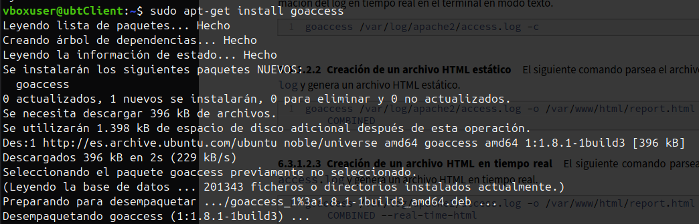

Hay varias formas de acceder a los logs. Una de ellas es por terminal, que para poder verlo tendremos que escribir el comando `sudo goaccess /var/log/apache2/access.log -c`

Nos pedirá el formato de fecha y hora. Podremos seleccionar la primera opción ***NCSA Combined Log Format*** o ***Common Log Format (CLF)***.

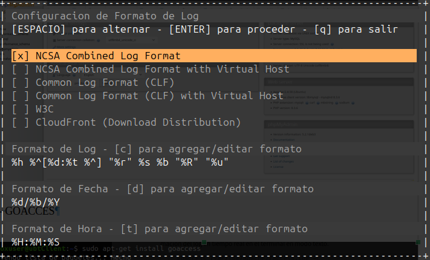

Y este sería el método por terminal.

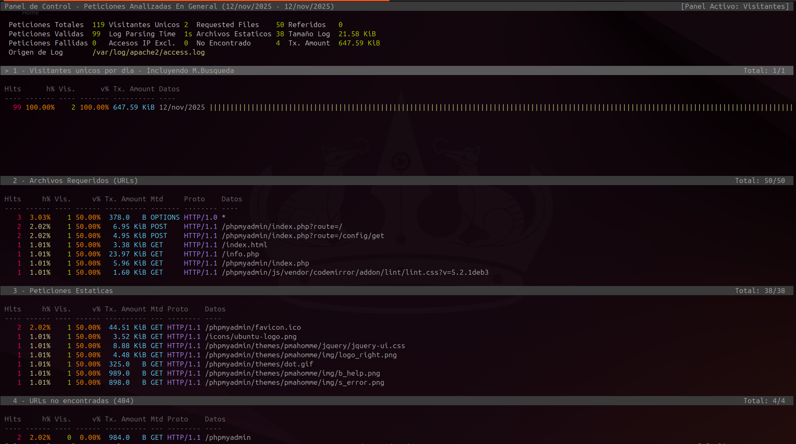

La otra forma para verlo es desde un archivo **html** que lo podremos consultar **A TIEMPO REAL** desde la web ejecutando el siguiente comando:

```sh
sudo goaccess /var/log/apache2/access.log -o /var/www/html/report.html –log-format= COMBINED –real-time-html
```

Y accedemos a la web de la siguiente manera: 

`http://ip_servidor/report.html`

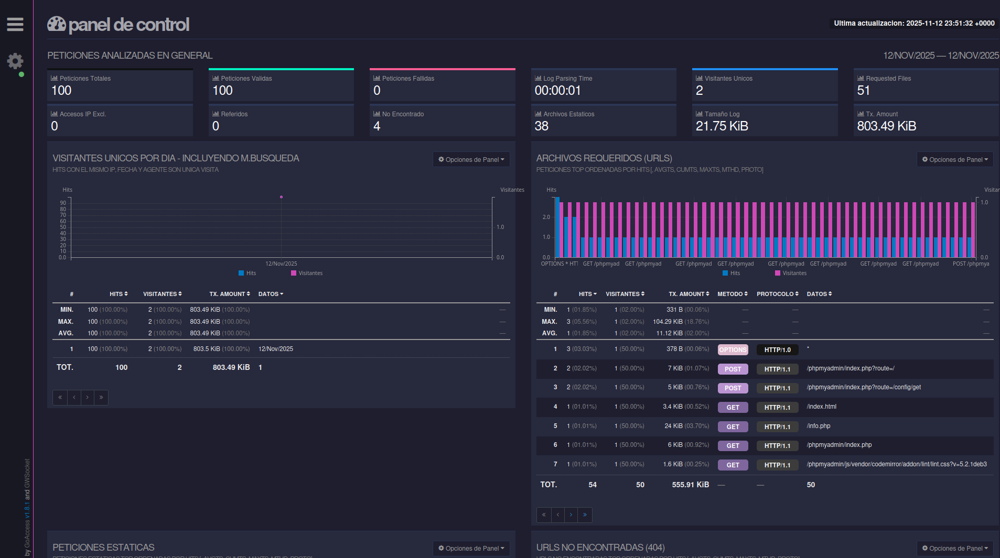

Con esto habremos instalado y configurado completamente **LAMP**.