# Tarea 3: LAMP en AWS

1. [Preparativos](#preparativos)
2. [Creación instancia EC2 mediante script](#creación-de-la-instancia-ec2-en-aws-mediante-script)
3. [Instalación LAMP en nuestra EC2](#instalación-lamp-en-nuestra-ec2)

<br/>

## Preparativos

En primer lugar, para tener el servicio de **aws** instalado en nuestra máquina host, tendremos que seguir los siguientes pasos:

```sh
## Vamos ejecutando línea por línea
### Buscamos el paquete de instalación con un curl y lo convertimos en un zip con la opción -o
curl "https://awscli.amazonaws.com/awscli-exe-linux-x86_64.zip" -o "awscliv2.zip"
# -------------------------------------------------------------------------------------------------
### Descomprimimos el archivo
unzip awscliv2.zip
# -------------------------------------------------------------------------------------------------
### Ejecutamos el ejecutable de nuestra carpeta descomprimida para instalar el paquete
sudo ./aws/install
```

En el momento de hacer un `aws --version` , si muestra información de la version es que ya está instalado:

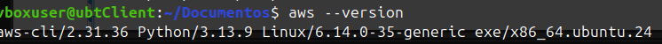

Ahora vamos a conectar nuestro AWS mediante ssh para poder crear la instancia remotamente con un script y agilizar el proceso:

Ejecutamos `aws configure` , esto lo que hace es **conectar con nuestro usuario de AWS** y guardar sus credenciales dentro de un archivo llamado `~/.aws/credentials` . 

Si ejecutamos el comando previamente explicado se nos mostrará lo siguiente:

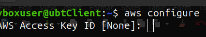

¿Y que son las credenciales que nos piden? Pues eso lo podremos encontrar en nuestro AWS. Lo podemos ver desde el laboratorio de mismo. Dentro de el, hacemos clic donde pone **AWS Details** y mostramos el **AWS CLI:** .

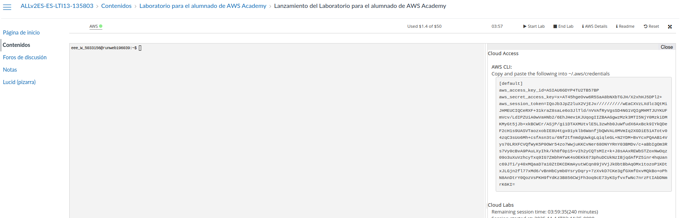

Donde pone **aws_access_key_id** y **aws_secret_acces_key** lo vamos a necesitar para el *aws configure*.

Ahora si volvemos a nuestra terminal e introducimos los datos...

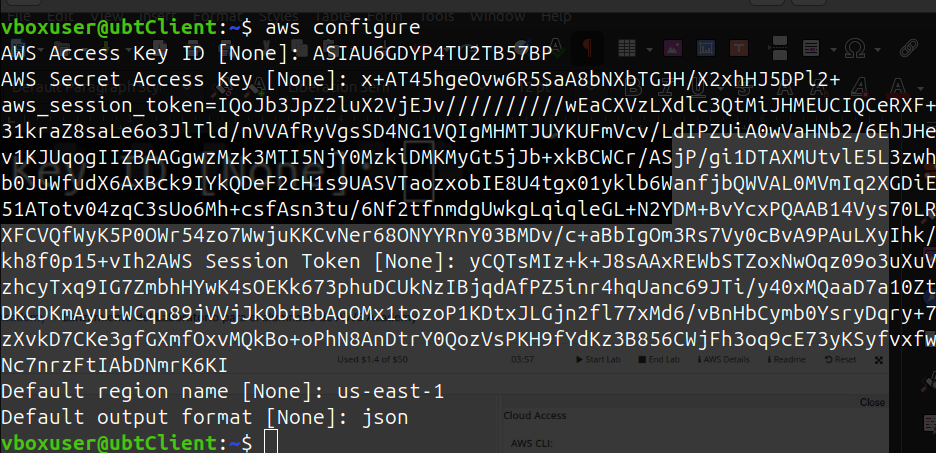

Con esto ya lo tendríamos configurado para poder proceder con la **creación de la instancia EC en AWS mediante script**.

## Creación de la instancia EC2 en AWS mediante script

Para crear la instancia, crearemos un archivo para ello:

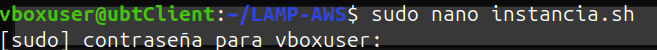

Tenemos el siguiente script para crear la instancia con nuestro LAMP:

```sh
#!/bin/bash

## Este script crea una instancia EC2 Ubuntu con AWS CLI (LAMP)

set -e  # Detener el script si ocurre un error

### Configuración
KEY_NAME="lamp-key" # Nombre de la llave
SECURITY_GROUP="lamp-sg" # Grupo de seguridad
INSTANCE_NAME="LAMP-AWS" # Nombre de la instancia
REGION="us-east-1" # Region de la instancia
INSTANCE_TYPE="t2.micro" # Tipo de instancia
KEY_PATH="$HOME/.ssh/${KEY_NAME}.pem" # Ubicación de nuestra llave

# ----------------------------------------------------------------------------------------------------------------------------------------------------------------------------------------------------------------------------------------------------------------------------------------------------------------------------------
# Aqui se obtiene la última AMI de Ubuntu Server 22.04 LTS

echo "Buscando la última AMI de Ubuntu 22.04..."

## Busca imágenes oficiales de Ubuntu (propietario 099720109477 = Canonical)
## Filtra solo Ubuntu 22.04 y selecciona la AMI más reciente.

AMI_ID=$(aws ec2 describe-images --region "$REGION" --owners 099720109477   --filters "Name=name,Values=ubuntu/images/hvm-ssd/ubuntu-jammy-22.04-amd64-server-*"   --query "Images | sort_by(@, &CreationDate)[-1].ImageId" --output text)

echo "AMI encontrada: $AMI_ID"


# ----------------------------------------------------------------------------------------------------------------------------------------------------------------------------------------------------------------------------------------------------------------------------------------------------------------------------------
# En este paso creamos o usamos nuestro par de claves

echo "Verificando par de claves..."

## Revisa si ya existe la clave en AWS
if aws ec2 describe-key-pairs --key-names "$KEY_NAME" --region "$REGION" >/dev/null 2>&1; then
  echo "La clave '$KEY_NAME' ya existe. Usando clave existente."
else
  ## Si no existe, crea una nueva
  echo "Creando nuevo par de claves..."

  ## Crea la clave y guarda su contenido en un archivo .pem
  aws ec2 create-key-pair --key-name "$KEY_NAME"     --query 'KeyMaterial' --output text > "$KEY_PATH"

  ## Permisos necesarios para usarla con SSH
  chmod 400 "$KEY_PATH"
  echo "Clave guardada en $KEY_PATH"
fi


# ----------------------------------------------------------------------------------------------------------------------------------------------------------------------------------------------------------------------------------------------------------------------------------------------------------------------------------
# Creamos o usamos un grupo de seguridad

echo "Verificando grupo de seguridad..."

## Verifica si ya existe un Security Group con ese nombre
EXISTING_GROUP_ID=$(aws ec2 describe-security-groups   --filters Name=group-name,Values="$SECURITY_GROUP"   --query "SecurityGroups[0].GroupId" --output text 2>/dev/null)

if [ "$EXISTING_GROUP_ID" != "None" ] && [ -n "$EXISTING_GROUP_ID" ]; then
  echo "Usando grupo de seguridad existente: $EXISTING_GROUP_ID"
  GROUP_ID=$EXISTING_GROUP_ID
else
  echo "Creando grupo de seguridad..."

  ## Crea un Security Group nuevo
  GROUP_ID=$(aws ec2 create-security-group --group-name "$SECURITY_GROUP"     --description "Grupo de seguridad para LAMP" --query 'GroupId' --output text)

  echo "Configurando reglas de acceso..."

  ## Permite SSH (22)
  aws ec2 authorize-security-group-ingress --group-id "$GROUP_ID" --protocol tcp --port 22 --cidr 0.0.0.0/0

  ## Permite HTTP (80)
  aws ec2 authorize-security-group-ingress --group-id "$GROUP_ID" --protocol tcp --port 80 --cidr 0.0.0.0/0

  ## Permite HTTPS (443)
  aws ec2 authorize-security-group-ingress --group-id "$GROUP_ID" --protocol tcp --port 443 --cidr 0.0.0.0/0

  echo "Grupo de seguridad creado: $GROUP_ID"
fi


# ----------------------------------------------------------------------------------------------------------------------------------------------------------------------------------------------------------------------------------------------------------------------------------------------------------------------------------
# Lanzamos la instancia EC2

echo "Lanzando instancia EC2..."

## Crea la instancia EC2 usando:
###  - la AMI obtenida
###  - el tipo t2.micro
###  - el par de claves
###  - el Security Group
###  - la región definida
###  - una etiqueta "Name"

INSTANCE_ID=$(aws ec2 run-instances   --image-id "$AMI_ID"   --count 1   --instance-type "$INSTANCE_TYPE"   --key-name "$KEY_NAME"   --security-group-ids "$GROUP_ID"   --region "$REGION"   --tag-specifications "ResourceType=instance,Tags=[{Key=Name,Value=$INSTANCE_NAME}]"   --query 'Instances[0].InstanceId' --output text)

echo "Esperando que la instancia se inicie..."

## Espera hasta que la instancia esté en estado "running"
aws ec2 wait instance-running --instance-ids "$INSTANCE_ID"


# ----------------------------------------------------------------------------------------------------------------------------------------------------------------------------------------------------------------------------------------------------------------------------------------------------------------------------------
# Asignamos una IP elástica

echo "Creando y asociando Elastic IP..."

## Crear una Elastic IP
ALLOC_ID=$(aws ec2 allocate-address --domain vpc --region "$REGION" --query 'AllocationId' --output text)

## Asociarla a la instancia
aws ec2 associate-address --instance-id "$INSTANCE_ID" --allocation-id "$ALLOC_ID" --region "$REGION"

## Obtener la IP pública asignada
EIP=$(aws ec2 describe-addresses --allocation-ids "$ALLOC_ID" --region "$REGION"   --query 'Addresses[0].PublicIp' --output text)


# ----------------------------------------------------------------------------------------------------------------------------------------------------------------------------------------------------------------------------------------------------------------------------------------------------------------------------------
# Este sería nuestro resultado final

echo "Instancia creada exitosamente"
echo "------------------------------------------"
echo "ID de instancia: $INSTANCE_ID"
echo "AMI: $AMI_ID"
echo "Grupo de seguridad: $GROUP_ID"
echo "Clave: $KEY_PATH"
echo "Elastic IP: $EIP"
echo "------------------------------------------"
echo "Conéctate con:"
echo "ssh -i "$KEY_PATH" ubuntu@$EIP"
```

Le damos permisos de ejcución al archivo con `sudo chmod 744 "nombre_archivo.sh"` . +x ==> rwx (users, groups and others)

Cuando hayamos creado el archivo con todo el script dentro, lo ejecutamos con `./nombre_archivo.sh`

Si funciona correctamente dará esta salida:

```
vboxuser@ubtClient:~$ ./instancia.sh 
Buscando la última AMI de Ubuntu 22.04...
AMI encontrada: ami-00b13f11600160c10
Verificando par de claves...
Creando nuevo par de claves...
Clave guardada en /home/vboxuser/.ssh/lamp-key.pem
Verificando grupo de seguridad...
Creando grupo de seguridad...
Configurando reglas de acceso...
{
    "Return": true,
    "SecurityGroupRules": [
        {
            "SecurityGroupRuleId": "sgr-07bd6de07661b9d05",
            "GroupId": "sg-0e78207f75f69011d",
            "GroupOwnerId": "339712966439",
            "IsEgress": false,
            "IpProtocol": "tcp",
            "FromPort": 22,
            "ToPort": 22,
            "CidrIpv4": "0.0.0.0/0",
            "SecurityGroupRuleArn": "arn:aws:ec2:us-east-1:339712966439:security-group-rule/sgr-07bd6de07661b9d05"
        }
    ]
}
{
    "Return": true,
    "SecurityGroupRules": [
        {
            "SecurityGroupRuleId": "sgr-092f67cbfc1dc9888",
            "GroupId": "sg-0e78207f75f69011d",
            "GroupOwnerId": "339712966439",
            "IsEgress": false,
            "IpProtocol": "tcp",
            "FromPort": 80,
            "ToPort": 80,
            "CidrIpv4": "0.0.0.0/0",
            "SecurityGroupRuleArn": "arn:aws:ec2:us-east-1:339712966439:security-group-rule/sgr-092f67cbfc1dc9888"
        }
    ]
}
{
    "Return": true,
    "SecurityGroupRules": [
        {
            "SecurityGroupRuleId": "sgr-08cd0c655dab3055b",
            "GroupId": "sg-0e78207f75f69011d",
            "GroupOwnerId": "339712966439",
            "IsEgress": false,
            "IpProtocol": "tcp",
            "FromPort": 443,
            "ToPort": 443,
            "CidrIpv4": "0.0.0.0/0",
            "SecurityGroupRuleArn": "arn:aws:ec2:us-east-1:339712966439:security-group-rule/sgr-08cd0c655dab3055b"
        }
    ]
}
Grupo de seguridad creado: sg-0e78207f75f69011d
Lanzando instancia EC2...
Esperando que la instancia se inicie...
Creando y asociando Elastic IP...
{
    "AssociationId": "eipassoc-0b9b2148091253df2"
}
Instancia creada exitosamente
------------------------------------------
ID de instancia: i-07977f5319fa010da
AMI: ami-00b13f11600160c10
Grupo de seguridad: sg-0e78207f75f69011d
Clave: /home/vboxuser/.ssh/lamp-key.pem
Elastic IP: 54.83.8.157
------------------------------------------
Conéctate con:
ssh -i /home/vboxuser/.ssh/lamp-key.pem ubuntu@54.83.8.157
```

Y si nos conectamos a la dirección que nos especifica:

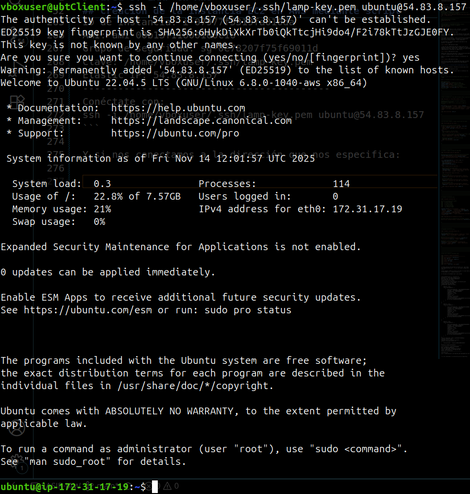

Y si nos dirigimos a nuestras **EC2** en AWS, veremos:

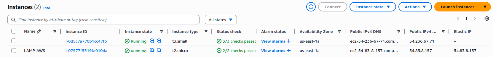


## Instalación LAMP en nuestra EC2

Ahora que ya estamos dentro de nuestra EC2 conectados por **ssh**, vamos a **crear el script de instalación del LAMP**.

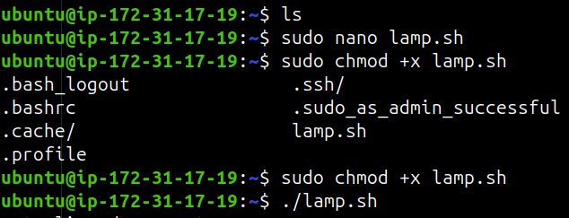

El código trata de instalar los paquetes necesarios para nuestro LAMP:

```sh
#!/bin/bash
# ============================================================
# Script: instalar_lamp.sh
# Descripción: Instala Apache, MySQL y PHP en Ubuntu (LAMP)
# ============================================================

set -e

echo "Actualizando paquetes..."
sudo apt update -y
sudo apt upgrade -y

echo "Instalando Apache..."
sudo apt install -y apache2
sudo systemctl enable --now apache2

echo "Instalando MySQL Server..."
sudo apt install -y mysql-server
sudo systemctl enable --now mysql

echo "Instalando PHP..."
sudo apt install -y php libapache2-mod-php php-mysql

echo "Creando archivo de prueba PHP..."
echo "<?php phpinfo(); ?>" | sudo tee /var/www/html/index.php > /dev/null

echo "Reiniciando Apache..."
sudo systemctl restart apache2

echo "------------------------------------------"
echo "LAMP instalado correctamente."
echo "Visita http://<tu-elastic-ip>/ para verificar."
echo "------------------------------------------"
```

**NO OLVIDE DE OTORGAR PERMISOS DE EJECUCIÓN AL ARCHIVO**. Una vez ya lo tenemos todo, lo ejecutamos:

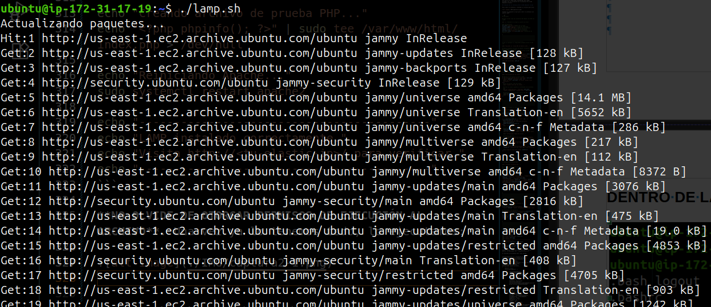

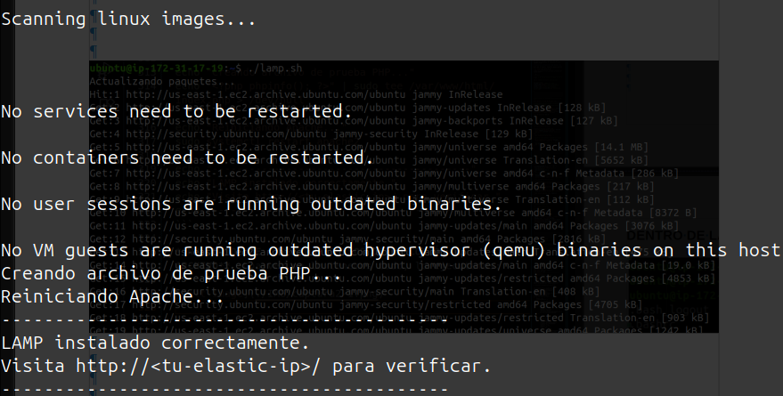

Una vez ejecutado el script, podremos comprobar con un `sudo systemctl status apache2` para comprobar que se ha instalado correctamente:

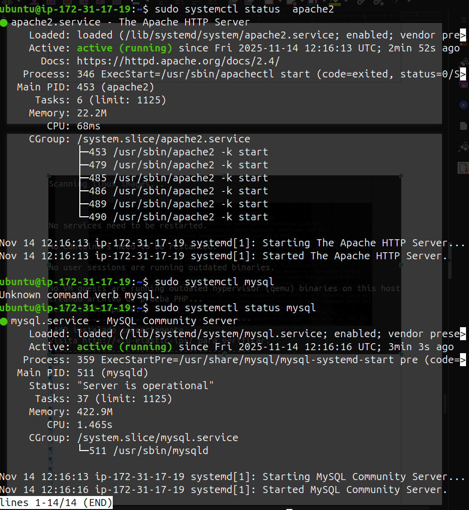

Y si nos vamos al navegador web e introducimos `http://ip_elastica` , si funciona, saldrá la página de apache 2.

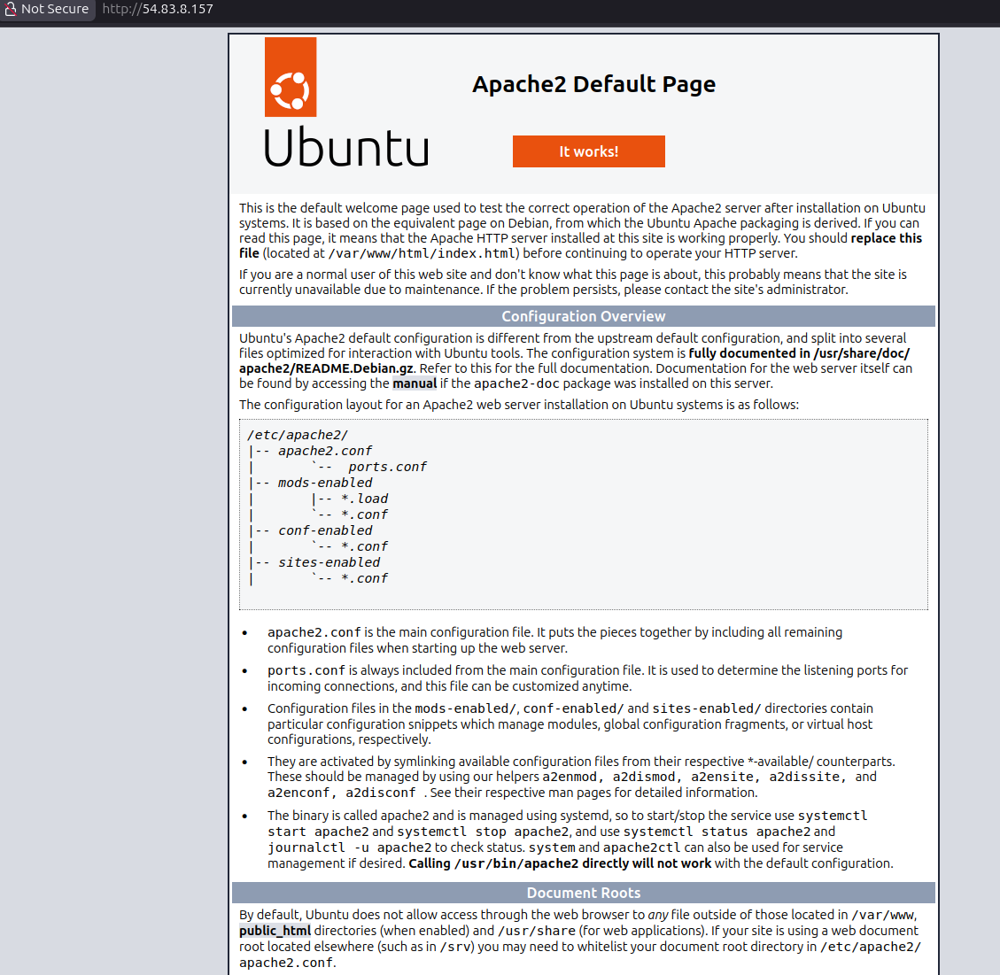

Con esto hemos finalizado esta práctica.