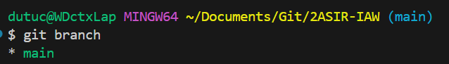
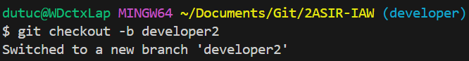
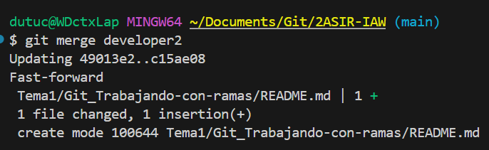
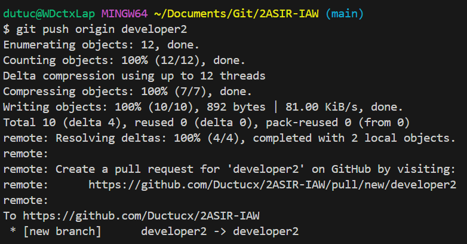
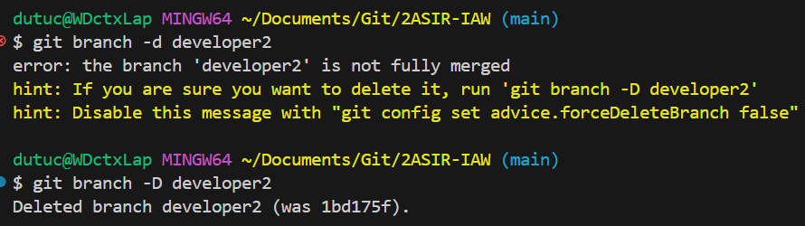

# APRENDIENDO SOBRE LAS RAMAS EN GIT

### Índice
  1. [Ejercicio individual](#ejercicios-individuales)
  - 1.1. [Apartado 1: Listar ramas locales](#apartado-1-listar-ramas-locales)
  - 1.2. [Apartado 2: Creación de una nueva rama](#apartado-2-creación-de-una-nueva-rama)
  - 1.3. [Apartado 3: Modificación](#apartado-3-modificación)
  - 1.4. [Apartado 4:Fusión](#apartado-4-fusión)
  - 1.5. [Apartado 5: Conflictos](#apartado-5-conflictos)
  - 1.6. [Apartado 6: Sincronizar repositorio remoto](#apartado-6-sincronizar-repositorio-remoto)
  - 1.7. [Apartado 7: Eliminando la rama](#apartado-7-eliminando-la-rama)

 

# EJERCICIOS INDIVIDUALES
## Apartado 1: Listar ramas locales
Para mirar las ramas que tenemos creadas ejecutamos un `git branch`

## Apartado 2: Creación de una nueva rama
Ahora para crear una rama ejecutamos un `git branch "nombre_rama"`.
Una vez creada nos movemos a ella con `git checkout "nombre_rama"`.

*También sirve* `git checkout -b "nombre_rama"` *para crearla y cambiarnos directamente.*

## Apartado 3. Modificación
Empezamos a fusionar...

Crearemos un fichero desde la rama que habremos creado y acabaremos con un commit:

## Apartado 4: Fusión
Ahora nos vamos a main y fusionamos la rama con `git merge "nombre_rama"`:

Si no hay conflictos, todo irá bien.

## Apartado 5: Conflictos
Crearemos a propósito un conflicto para solucionarlo.

Primero crearemos un fichero ***prueba.txt*** en la rama ***main*** y haremos un commit.

Cambiamos a una nueva rama, modificamos el fichero y haremos otro commit.

Volvemos a la rama ***main***, modificamos el fichero de nuevo y luego intentaremos fusionar la nueva rama.

Si surge un conflicto, Git te lo mostrará y podrás resolverlo manualmente.

## Apartado 6: Sincronizar repositorio remoto
Para sincronizar con el repositorio remoto, subiremos la rama local con `git push origin "nombre_rama"`:

## Apartado 7: Eliminando la rama
Finalmente, una vez fusionada, la eliminamos para mantener el repositorio limpio utilizando `git branch -d "nombre_rama"`:

#