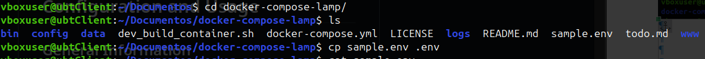
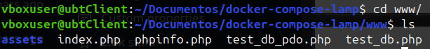
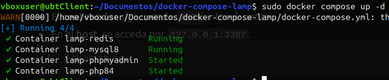

# Tarea 2: LAMP en Docker Compose

1. [Preparativos](#preparativos)
2. [Repositorio](#repositorio)
3. [Dockerfile](#dockerfile)
  - 3.1. [PHP](#php)
  - 3.2. [Control de errores](#control-de-los-errores-con-puertos)
4. [Archivo PHP](#archivo-php)

<br/>

## Preparativos

Antes de empezar con la práctica, debemos de instalar un par de paquetes esenciales que, sin ellos, no podremos proceder con las actividades.

Debemos de tener `docker compose` instalado listo para utilizarlo, por ello, si visitamos la [página oficial](https://docs.docker.com/compose/install/linux/#install-using-the-repository) de docker veremos los pasos para la configuración del repostiorio.

Seleccionamos nuestra version de linux, en nuestro caso será Ubuntu.

**SI SU SISTEMA OPERATIVO NO ES UBUNTU, POR FAVOR, SELECCIONE SU VERSIÓN Y SIGA LOS PASOS INDICADOS EN LA DOCUMENTACIÓN OFICIAL**

Comandos a ejecutar:

```sh
# Add Docker's official GPG key:
## Ejecutamos línea por línea este primer bloque.
sudo apt-get update
sudo apt-get install ca-certificates curl
sudo install -m 0755 -d /etc/apt/keyrings
sudo curl -fsSL https://download.docker.com/linux/ubuntu/gpg -o /etc/apt/keyrings/docker.asc
sudo chmod a+r /etc/apt/keyrings/docker.asc

# Add the repository to Apt sources:
## Ahora podremos ejecutar todo este bloque directamente.
echo \
  "deb [arch=$(dpkg --print-architecture) signed-by=/etc/apt/keyrings/docker.asc] https://download.docker.com/linux/ubuntu \
  $(. /etc/os-release && echo "${UBUNTU_CODENAME:-$VERSION_CODENAME}") stable" | \
  sudo tee /etc/apt/sources.list.d/docker.list > /dev/null
sudo apt-get update
```

Ahora con todo esto

## Repositorio

El [repositorio](https://github.com/sprintcube/docker-compose-lamp?utm_source=chatgpt.com) que tomamos como referencia, nos explica paso a paso lo que se tiene que hacer para poder crear un LAMP con Docker.

**Antes de nada, mencionar que el repostiorio mostrado anteriormente pertenece a la cuenta de github "[narendravaghela](https://github.com/narendravaghela)" y todos los méritos son del mismo, no nuestros.**

**El repositorio solo se utilizará para fines educativos, cualquier información adicional por favor consultad el repositorio oficial del autor.**

## Dockerfile, PHP y control de los errores con puertos

Los pasos a seguir son los siguientes:

```sh
git clone https://github.com/sprintcube/docker-compose-lamp.git
cd docker-compose-lamp/
cp sample.env .env
// modify sample.env as needed
docker compose up -d
// visit localhost
```



---
### PHP

Importante nuestro archivo **index.php** se encuentra en la siguiente dirección:



Si mostramos lo que contiene el fichero obtenemos lo siguiente:

```php
<!DOCTYPE html>
<html lang="en">
    <head>
        <meta charset="utf-8">
        <meta name="viewport" content="width=device-width, initial-scale=1">
        <title>LAMP STACK</title>
        <link rel="shortcut icon" href="/assets/images/favicon.svg" type="image/svg+xml">
        <link rel="stylesheet" href="/assets/css/bulma.min.css">
    </head>
    <body>
        <section class="hero is-medium is-info is-bold">
            <div class="hero-body">
                <div class="container has-text-centered">
                    <h1 class="title">
                        LAMP STACK
                    </h1>
                    <h2 class="subtitle">
                        Your local development environment
                    </h2>
                </div>
            </div>
        </section>
        <section class="section">
            <div class="container">
                <div class="columns">
                    <div class="column">
                        <h3 class="title is-3 has-text-centered">Environment</h3>
                        <hr>
                        <div class="content">
                            <ul>
                                <li><?= apache_get_version(); ?></li>
                                <li>PHP <?= phpversion(); ?></li>
                                <li>
                                    <?php
                                    $link = mysqli_connect("database", "root", $_ENV['MYSQL_ROOT_PASSWORD'], null);

/* check connection */
                                    if (mysqli_connect_errno()) {
                                        printf("MySQL connecttion failed: %s", mysqli_connect_error());
                                    } else {
                                        /* print server version */
                                        printf("MySQL Server %s", mysqli_get_server_info($link));
                                    }
                                    /* close connection */
                                    mysqli_close($link);
                                    ?>
                                </li>
                            </ul>
                        </div>
                    </div>
                    <div class="column">
                        <h3 class="title is-3 has-text-centered">Quick Links</h3>
                        <hr>
                        <div class="content">
                            <ul>
                                <li><a href="/phpinfo.php">phpinfo()</a></li>
                                <li><a href="http://localhost:<? print $_ENV['PMA_PORT']; ?>">phpMyAdmin</a></li>
                                <li><a href="/test_db.php">Test DB Connection with mysqli</a></li>
                                <li><a href="/test_db_pdo.php">Test DB Connection with PDO</a></li>
                            </ul>
                        </div>
                    </div>
                </div>
            </div>
        </section>
        <footer class="footer">
            <div class="content has-text-centered">
                <p>
                    <strong><a href="https://www.sprintcube.com" target="_blank">SprintCube</a></strong><br>
                    The source code is released under the <a href="https://github.com/sprintcube/docker-compose-lamp/blob/master/LICENSE" target="_blank">MIT license</a>.
                </p>
            </div>
        </footer>
    </body>
</html>
```
---
### Control de los errores con puertos

Nuestro docker compose del repositorio consta de las siguientes líneas:

```yaml
version: "3"

services:
  webserver:
    build:
      context: ./bin/${PHPVERSION}
    container_name: "${COMPOSE_PROJECT_NAME}-${PHPVERSION}"
    restart: "always"
    ports:
      - "${HOST_MACHINE_UNSECURE_HOST_PORT}:80"
      - "${HOST_MACHINE_SECURE_HOST_PORT}:443"
    links:
      - database
    volumes:
      - ${DOCUMENT_ROOT-./www}:/var/www/html:rw
      - ${PHP_INI-./config/php/php.ini}:/usr/local/etc/php/php.ini
      - ${SSL_DIR-./config/ssl}:/etc/apache2/ssl/
      - ${VHOSTS_DIR-./config/vhosts}:/etc/apache2/sites-enabled
      - ${LOG_DIR-./logs/apache2}:/var/log/apache2
      - ${XDEBUG_LOG_DIR-./logs/xdebug}:/var/log/xdebug
    environment:
      APACHE_DOCUMENT_ROOT: ${APACHE_DOCUMENT_ROOT-/var/www/html}
      PMA_PORT: ${HOST_MACHINE_PMA_PORT}
      MYSQL_ROOT_PASSWORD: ${MYSQL_ROOT_PASSWORD}
      MYSQL_USER: ${MYSQL_USER}
      MYSQL_PASSWORD: ${MYSQL_PASSWORD}
      MYSQL_DATABASE: ${MYSQL_DATABASE}
      HOST_MACHINE_MYSQL_PORT: ${HOST_MACHINE_MYSQL_PORT}
      XDEBUG_CONFIG: "client_host=host.docker.internal remote_port=${XDEBUG_PORT}"
    extra_hosts:
      - "host.docker.internal:host-gateway"
  database:
    build:
      context: "./bin/${DATABASE}"
    container_name: "${COMPOSE_PROJECT_NAME}-${DATABASE}"
    restart: "always"
    ports:
      - "127.0.0.1:${HOST_MACHINE_MYSQL_PORT}:3306"
    volumes:
      - ${MYSQL_INITDB_DIR-./config/initdb}:/docker-entrypoint-initdb.d
      - ${MYSQL_DATA_DIR-./data/mysql}:/var/lib/mysql
      - ${MYSQL_LOG_DIR-./logs/mysql}:/var/log/mysql
      - ${MYSQL_CNF-./config/mysql/my.cnf}:/etc/my.cnf
    environment:
      MYSQL_ROOT_PASSWORD: ${MYSQL_ROOT_PASSWORD}
      MYSQL_DATABASE: ${MYSQL_DATABASE}
      MYSQL_USER: ${MYSQL_USER}
      MYSQL_PASSWORD: ${MYSQL_PASSWORD}
  phpmyadmin:
    image: phpmyadmin
    container_name: "${COMPOSE_PROJECT_NAME}-phpmyadmin"
    links:
      - database
    environment:
      PMA_HOST: database
      PMA_PORT: 3306
      PMA_USER: root
      PMA_PASSWORD: ${MYSQL_ROOT_PASSWORD}
      MYSQL_ROOT_PASSWORD: ${MYSQL_ROOT_PASSWORD}
      MYSQL_USER: ${MYSQL_USER}
      MYSQL_PASSWORD: ${MYSQL_PASSWORD}
      UPLOAD_LIMIT: ${UPLOAD_LIMIT}
      MEMORY_LIMIT: ${MEMORY_LIMIT}
    ports:
      - "${HOST_MACHINE_PMA_PORT}:80"
      - "${HOST_MACHINE_PMA_SECURE_PORT}:443"
    volumes:
      - /sessions
      - ${PHP_INI-./config/php/php.ini}:/usr/local/etc/php/conf.d/php-phpmyadmin.ini
  redis:
    container_name: "${COMPOSE_PROJECT_NAME}-redis"
    image: redis:latest
    ports:
      - "127.0.0.1:${HOST_MACHINE_REDIS_PORT}:6379"
```

**OJO CUIDADO !!!**

Si por alguna casualidad ya tenemos instalado LAMP en nuestra máquina local, lo mas seguro es que se de conflictos con los puertos. En ese caso aparecerá un mensaje de error con **EL PUERTO** que falla, y ese mismo habrá que cambiarlo por otro o bien parar nuestros servicios de **apache2** y **mysql** en la máquina host.

Para pararlos ejecutamos:

```sh
sudo systemctl stop apache2
sudo systemctl stop mysql
```

Ahora bien si no queremos parar los servicios y simplemente queremos que funcionen ambos, tanto en máquina local como docker, procederemos con los siguientes pasos.

*En este ejemplo breve, en la instalación vemos que el puerto del MySQL esta dando fallos...*
```golang
[+] Running 6/7
 ✔ lamp-webserver             Built                                                                                                                                                      0.0s 
 ✔ lamp-database              Built                                                                                                                                                      0.0s 
 ✔ Network lamp_default       Created                                                                                                                                                    0.2s 
 ✔ Container lamp-redis       Started                                                                                                                                                    1.6s 
 ⠦ Container lamp-mysql8      Starting                                                                                                                                                   1.8s 
 ✔ Container lamp-phpmyadmin  Created                                                                                                                                                    0.2s 
 ✔ Container lamp-php84       Created                                                                                                                                                    0.2s 
Error response from daemon: failed to set up container networking: driver failed programming external connectivity on endpoint lamp-mysql8 (eca5797d0e1205defbd9421d071583213bf51233940cc69d94afca0fd0a53250): failed to bind host port 127.0.0.1:3306/tcp: address already in use

```

Entonces nos vamos a nuestro archivo de configuración de docker compose: `docker-compose.yml`

Y en la parte donde pone "database" cambiamos a otro puerto que no se este utilizando, el `3307` si no lo estamos utilizando:

```yaml
  database:
    build:
      context: "./bin/${DATABASE}"
    container_name: "${COMPOSE_PROJECT_NAME}-${DATABASE}"
    restart: "always"
    ports:
      - "127.0.0.1:3307:3306" ## Aqui hemos cambiado al puerto 3307
```

Una vez cambiado esto, intentamos hacer otra vez el `sudo docker compose up -d` .

Si todo esta bien, nos devolverá el mensaje de confirmación de que todo funciona correctamente:

```golang
[+] Running 4/4
 ✔ Container lamp-redis       Running                                                                                                                                                    0.0s 
 ✔ Container lamp-mysql8      Running                                                                                                                                                    0.0s 
 ✔ Container lamp-phpmyadmin  Started                                                                                                                                                    1.7s 
 ✔ Container lamp-php84       Started    
```



## CONTINUARÁ