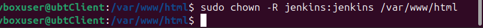
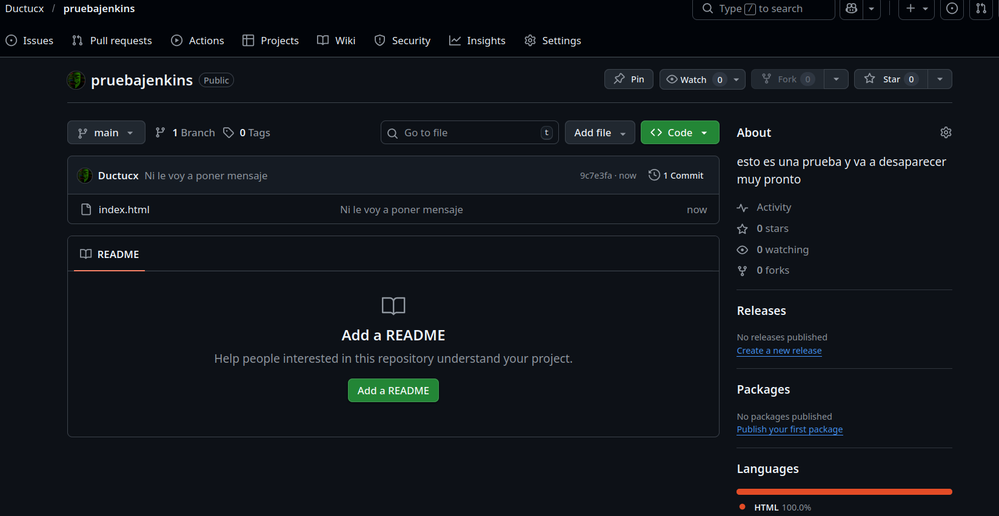
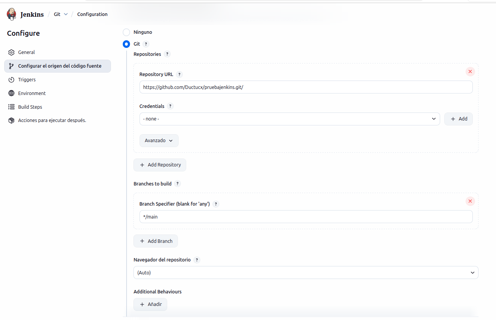
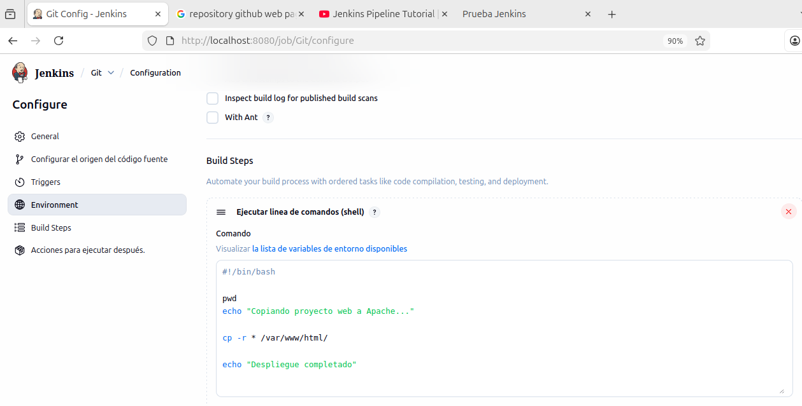
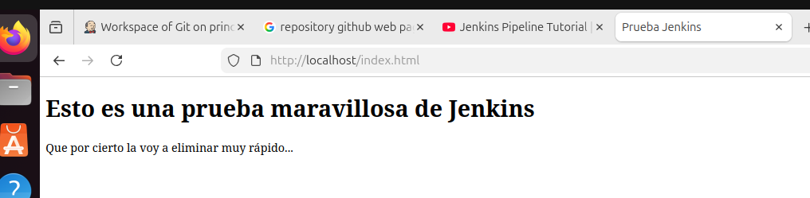

# FreestyleJob

1. [Asignar permisos al usuario](#asignar-permisos-al-usuario)
2. [Creando el "Job"](#creando-el-job)

<br/>

# Asignar permisos al usuario

Antes de nada, para poder seguir con el procedimiento de clonar un repositorio con un html y mostrarlo en la web, tendremos que otorgarle los permisos necesarios al usuario `jenkins` .



Cabe destacar que para este procedimiento también tendremos que instalar `apache2` y `git` en nuestrá máquina con jenkins instalado...

```sh
sudo apt update
sudo apt install apache2
sudo apt install git
```
<br>

---
# Creando el "Job"

Clonamos el repositorio con nuestro html:



Cabe destacar que para este procedimiento también tendremos que instalar `apache2` y `git` en nuestrá máquina con jenkins instalado...

```sh
sudo apt update
sudo apt install apache2
sudo apt install git
```

Una vez realizado lo anterior, nos dirigimos a la configuración de jenkins. Creamos el "Job" y vamos a su configuración. Rellenamos los siguientes campos de la siguiente manera:





Ahora si probamos aconectarnos a la página web, nos saldrá el resultado de la página web.

